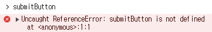
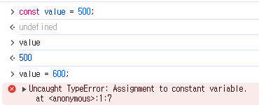

# [04장] 변수(Variable)

## 4.1 변수란 무엇인가? 왜 필요한가?

```
📂변수란? 하나의 값을 저장하기 위해 확보한 메모리 공간 자체 또는 메모리 공간을 식별하기 위한 이름. 즉, 값의 위치를 가리키는 상직적인 이름을 뜻함
```

### 메모리 공간?

- 메모리: 데이터를 저장할 수 있는 메모리 셀(cell)의 집합체
- 메모리 셀의 크기: 1byte(8bit) → 컴퓨터는 1바이트 단위로 데이터를 저장하고 읽어 들임
- 메모리 주소: 각 메모리 셀마다의 고유한 주소 → 메모리 공간의 위치를 의미하며 메모리 크기만큼의 주솟값을 갖음 (4GB 메모리라면 0x00000000부터 0xFFFFFFFF까지 4,294,967,296개)

❗ 우리가 사용하는 모든 데이터는 2진수의 형태로 메모리에 보관된다. 하지만 메모리에 직접 접근해서 값을 다루면 치명적 오류가 발생할 수 있기 때문에, JS는 개발자의 직접적인 메모리 제어를 허용하지 않는다. 만약 허용하더라도 매번 메모리 상황에 맞춰 빈 주솟값에 값이 저장되기 때문에 메모리 주소를 통해 값에 접근할 수 없다.

💡 그렇기에 우리가 접근하고 싶은 값의 메모리 주소를 변수에 담는다면, 이는 프로그래밍 언어의 컴파일러 또는 인터프리터에 의해 값이 저장된 메모리 공간의 주소로 치환되어 실행된다. 이렇듯 변수를 사용하면 안전하게 값에 접근할 수 있다.

### 변수의 사용법

- 변수명(변수 이름): 메모리 공간에 저장된 값을 식별할 수 있는 **고유한** 이름. 개발자의 의도를 나타낼 수 있도록 이해하기 쉽게 작성하여야 함
- 할당(assignment): 변수에 값을 저장하는 것
- 참조(reference): 변수에 저장된 값을 읽어 들이는 것

<br>

## 4.2 식별자

```
🔍식별자란? 어떤 값을 구별해서 식별할 수 있는 고유한 이름
```

- 식별자는 변수에 한정된 의미가 아닌, 함수, 클래스 등 값이 저장된 메모리 주소와 매핑 관계를 맺으면 모두 식별자라 불림(매핑 관계 또한 메모리에 저장됨)
- 식별자는 **선언(declaration)** 에 의해 자바스크립트 엔진에 식별자의 존재를 알림

<br>

## 4.3 변수 선언

```
📂변수 선언이란? 변수를 생성하는 것. 자세히는 값을 저장하기 위한 메모리 공간을 확보하고, 변수 이름과 확보된 메모리 공간의 주소를 연결(name binding)해서 값을 저장할 수 있게 준비하는 과정
```

이렇게 변수 선언으로 확보된 메모리 공간은 해제(release)되기 전까지 누구도 메모리 공간을 사용할 수 없다. 함수 선언의 키워드로는 var, let, const가 있다.(var의 경우 블록 레벨 스코프가 아닌 함수 레벨 스코프를 지원하기에 호이스팅이 발생할 수 있어 의도치 않은 전역 변수로써의 역할을 할 수도 있다.)

> Keyword: var, let과 같이 자바스크립트 엔진이 수행할 동작을 규정한 일종의 명령어. 자바스크립트 엔진은 해당 키워드를 만나면 자신이 수행해야 할 약속된 동작을 수행함

### 변수 선언 단계

1. 선언 단계: 변수 이름을 등록해서 자바스크립트 엔지에 변수의 존재를 알림
2. 초기화 단계: 값을 저장하기 위한 메모리 공간을 확보하고, undefined를 할당하여 초기화함

<br>

> 초기화: 변수가 선언된 이후 최초로 값을 할당하는 것

※ 초기화 하는 이유: 초기화 단계를 거치지 않으면 확보된 메모리 공간에는 이전에 다른 app이 사용했던 **쓰레기 값(garbage Value)** 이 남아있을 수 있는데, 메모리 공간을 확보한 다음, 값을 할당하지 않은 상태에서 곧바로 변수 값을 참조하면 그런 일이 생길 수 있다.

※ 자바스크립트의 var 키워드를 사용한 변수 선언은 **'선언 단계'** 와 **'초기화 단계'** 가 동시에 진행되며, 암묵적으로 undefined가 할당된다. 또한 초기화를 진행하기 때문에 쓰레기 값이 나올 위험으로부터 안전하다.



※ 선언하지 않은 모든 식별자에 접근하면 참조 에러(ReferenceError)가 발생하게 되므로 주의해야 한다.

## 4.4 변수 선언의 실행 시점과 변수 호이스팅

자바스크립트 코드는 인터프리터에 의해 한 줄씩 순차적으로 실행된다.

```
💡 변수 선언 시점: 런타임(runtime) 이전에, 소스코드가 인터프리터에 의해 한 줄씩 순차적으로 실행되는 시점에 먼저 실행됨
```

자바스크립트 엔진은 한 줄씩 소스코드를 순차적으로 실행하기에 앞서 소스코드의 평가 과정을 거치는데, 이때 변수 선언을 포함한 모든 선언문(변수 선언문, 함수 선언문)을 소스코드에서 찾아내 런타임 이전에 먼저 실행한다.

❗ 따라서 JS 엔진은 변수 선언이 소스코드 어디에 있든 상관없이 다른 코드보다 먼저 실행하며, 어디서든 변수를 참조할 수 있다. 그렇기에 var, let, const, function, function\*, class 키워드를 사용해서 선언하는 모든 식별자(변수, 함수, 클래스 등)는 호이스팅 된다.

```
💡 변수 호이스팅(hoisting): 변수 선언문이 코드의 선두로 끌어 올려진 것처럼 동작하는 자바스크립트 고유의 특징
```

```jsx
/* 호이스팅 되어 변수 선언과 undefined로의 초기화가 이루어진 모습 */
console.log(score); // undefined

var score;
```

```jsx
/* 변수 선언은 되었으나, TDZ 존에 걸려 초기화가 이루어지지 않음 */
console.log(score); //ReferenceError(참조 에러) 발생

let score;
```

## 4.5 값의 할당

```jsx
var score; // 변수 선언
scroe = 80; // 값의 할당

var grade = 4; // 변수 선언과 값의 할당
```

값의 할당은 할당 연산자 = 를 사용한다.

❗ **변수 선언**은 소스코드가 순차적으로 실행되는 시점인 **런타임 이전**에 먼저 실행되지만, **값의 할당**은 **런타임에** 실행된다는 점을 기억!

❗ 이미 undefined로 초기화되어 있는 var 변수에 값을 할당할 경우, undefined가 저장되어 있던 메모리 공간을 지우고 그 메모리 공간에 새로운 값을 할당하는 것이 아니라 새로운 메모리 공간을 할당하고 그곳에 할당 값을 저장한다는 점 주의하기!

## 4.6 값의 재할당

```jsx
let score = 80; // 변수 선언 + 초기화 + 값의 할당 모두 일어남
score = 100; // 값의 재할당
```

- 상수(constant): 값을 재할당할 수 없어, 저장된 값을 변경할 수 없는 변수



=> const 키워드는 값의 재할당이 금지되기에 상수로서 단 한번만 할당 가능함

> 가비지 콜렉터(Garbage Collector): 메모리 공간을 주기적으로 검사하여 어떤 식별자도 참조하지 않아 더 이상 사용되지 않는 메모리를 해제시킨다. 자바스크립트는 가비지 콜렉터를 내장하고 있는 managed 언어로서 가비지 콜렉터를 통해 메모리 누수를 방지함

> 매니지드 언어 VS 언매니지드 언어 <br> 1. 매니지드 언어(Managed Language): C언어 같이 개발자가 명시적으로 메모리를 할당하고 해제하기 위해 malloc()과 free() 같은 low-level 메모리 제어기능을 제공함. 개발자가 직접 메모리를 제어할 수 있어 높은 수준의 최적화도 가능하지만 그만큼 오류가 발생할 위험도도 높다. <br><br> 2. 언매니지드 언어(Unmanaged Language): 자바스크립트가 여기에 해당되며 메모리의 할당 및 해제를 위한 메모리 기능 관리 기능을 언어 차원에서 담당하고 개발자가 관여할 수 없다. 더 이상 사용하지 않는 메모리의 해제는 가비지 콜렉터가 수행한다. 어느 정도의 일정한 생산성을 확보할 수 있어 안정적이나, 성능 면에서 어느 정도 손실을 감수해야 한다.

## 4.7 식별자 네이밍 규칙

- 특수문자를 제외한 문자, 숫자, 언더스코어(\_), 달러 기호($)를 포함할 수 있음
- 특수문자를 제외한 문자, 언더스코어(\_), 달러 기호($)로 시작해야 함. 숫자로 시작할 수 없음
- 예약어는 사용할 수 없음

> 예약어: 프로그래밍 언어에서 사용되고 있거나 사용될 예정인 단어. await, break, const, this, true, for, return 등이 있다.

### 네이밍 컨벤션(Naming Convention)

- 하나 이상의 영어 단어로 구성된 식별자를 가독성 좋게 만들기 위해 규정한 명명 규칙
- camelCase: 변수, 함수
- PascalCase: 생성자 함수, 클래스 이름

```jsx
// 카멜 케이스 (camelCase) -> 주로 변수/함수명
var firstName;

// 파스칼 케이스 (PascalCase) -> 주로 생성자 함수, 클래스명
var FirstName;

// 스네이크 케이스 (snake_case)
var first_name;

// 헝가리언 케이스 (typeHungarianCase)
var strFirstName; // type + identifier
var $elem = document.getElementById("myId"); // DOM 노드
var observable$ = fromEvent(document, "click"); // RxJS 옵저버블
```
