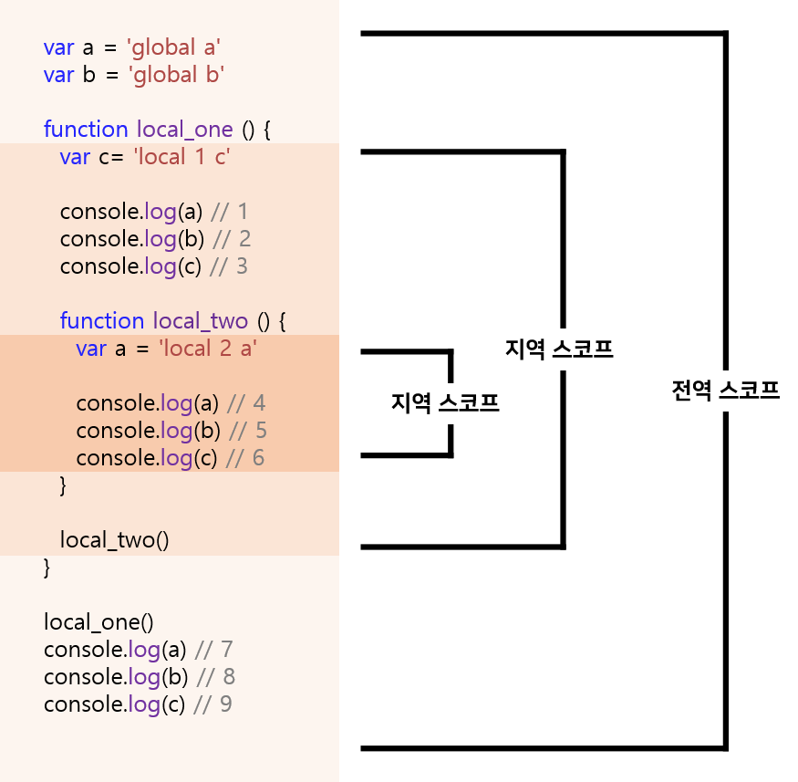

# [13장] 스코프 (scope) : 유효범위

```jsx
// 1. 첫번째 예제
function add(x, y) {
  // 매개변수는 함수 몸체 내부에서만 참조할 수 있다
  // 즉, 매개변수의 스코프(유효범위)는 함수 몸체 내부다
  console.log(x, y); // 2 5
  return x + y;
}

add(2, 5);

// 매개변수는 함수 몸체 내부에서만 참조할 수 있다
console.log(x, y); // ReferenceError

// 2. 두번째 예제
var var1 = 1; // 코드의 가장 바깥 영역에서 선언한 변수

if (true) {
  var varw = 2; // 코드 블록 내에서 선언한 변수

  if (true) {
    var 3 = 3; // 중첩된 코드 블록 내에서 선언한 변수
  }
}

function foo () {
  var var4 = 4; // 함수 내에서 선언한 변수

  function bar() {
    var var5 = 5; // 중첩된 함수 내에서 선언한 변수
  }
}

console.log(var1) // 1
console.log(var2) // 2
console.log(var3) // 3
console.log(var4) // ReferenceError
console.log(var5) // ReferenceError
```

> 모든 식별자(변수 이름, 함수 이름, 클래스 이름 등)는 자신이 선언된 위치에 의해 다른 코드가 식별자 자신을 참조할 수 있는 유효범위가 결정. <br>
> 이름 스코프라한다. 즉 스코프는 **식별자가 유효한 범위**

```jsx
var x = "global";

function foo() {
  var x = "local";
  console.log(x);
}

foo();

console.log(x);
```

> **🪐 코드와 문맥 환경**
> "코드가 어디서 실행되며 주변에 어떤 코드가 있는지"를 렉시컬 환경(lexical environment)이라고 부른다. 즉, 코드의 문맥(context)은 렉시컬 환경으로 이뤄진다. 이름 구현한 것이 "실행 컨덱스트(exeution context)"이며, 모든 코드는 실행 컨덱스트에 평가되고 실행된다.

## ✅ 스코프의 종류

| 구분 | 설명                  | 스코프      | 변수      |
| ---- | --------------------- | ----------- | --------- |
| 전역 | 코드의 가장 바깥 영역 | 전역 스코프 | 전역 변수 |
| 지역 | 함수 몸체 내부        | 지역 스코프 | 지역 변수 |

### 📍 전역과 전역 스코프



- 전역 스코프 : 변수는 어디서든지 참조 가능
- 지역 스코프 : 지역이란 함수 몸체 내부를 말한다. 지역 변수는 자신의 지역 스코프와 하위 지역 스코프에서 유효

### 📍 스코프 체인

- 중첩 함수 : 함수 몸체 내부에서 함수가 정의된 것
- 외부 함수 : 중첩 함수를 포함하는 함수

함수는 중첩될 수 있고, 함수의 지역 스코프도 중첩될 수 있다.
이말은 곧~! 스코프가 함수의 중첩에 의해 **계층적 구조**를 갖는다는 것을 의미!


<i>참조 : <a href="https://velog.io/@bathingape/스코프Scope와-클로저Closure-이해">https://velog.io/@bathingape/스코프Scope와-클로저Closure-이해</a></i>

이처럼 모든 스코프는 하나의 계층적 구조로 연결되며, 이렇게 스코프가 계층적으로 연결된 것을 스코프 체인이라고 한다

변수를 참조할 떄 자바스크립트 엔진인 스코프 체인을 통해 변수를 참조하는 코드의 스코프에서 시작하여 상위 스코프 방향으로 이동하며 선언된 변수를 검색한다.

이를 통해 상위 스코프에서 선언한 변수를 하위 스코프에서도 참조할 수 있는 것!

> **렉시컬 환경** <br>
> 스코프 체인은 실행 컨텍스트의 렉시컬 환경을 단방향으로 연결한 것. 전역 렉시컬 환경은 코드가 로드되면 곧바로 생성되고 함수의 렉시컬 환경은 함수가 호출되면 곧바로 생성

### 📍 스코프 체인에 의한 변수 검색

상위 스코프로 이동하며 변수를 참조하고 검색

**상위 스코프에서 유효한 변수는 하위 스코프에서 자유롭게 참조할 수 있지만 하위 스코프에서 유효한 변수를 상위 스코프에서 참조할 수는 없다**

### 📍 스코프 체인에 의한 함수 검색

함수도 식별자에 할당되기에 스코프를 갖게 된다.
사실 함수는 식별자에 함수 객체가 할당된 것 외에는 일반 변수와 다를 바 없다 ㅎㅎ
스코프는 식별자를 검색하는 규칙

```jsx
// 전역 함수
function foo() {
  console.log("global function foo");
}

function bar() {
  // 중첩 함수
  function foo() {
    console.log("local function foo");
  }

  foo();
}

bar(); // "local function foo"
```

## ✅ 함수 레벨 스코프

지역은 함수 몸체 내부를 뜻하고 지역은 지역 스코프를 만든다
코드 블록이 아닌 함수에 의해서만 지역 스코프가 생성된다는 뜻!
이러한 특성을 **블록 레벨 스코프**라고 말한다 <br>

하지만 var키워드로 선언된 변수는 오로지 함수의 코드 블록(함수 몸체)만을 지역 스코프로 인정하고 이러한 특성을 **함수 레벨 스코프**라고 한다

## ✅ 렉시컬 스코프

```jsx
var x = 1;

function foo() {
  var x = 10;
  bar();
}

function bar() {
  console.log(x);
}

// 출력 결과는 undefined이다
```

위의 예제에 대해 생각해보자 🌞

우선 두 가지 패턴을 예측할 수 있다.

1. **함수를 어디서 호출**했는지에 따라 함수의 상위 스코프 결정
1. **함수를 어디서 정의**했는지에 따라 함수의 상위 스코프 결정

1번째 방식을 동적 스코프라 한다.
함수를 정의하는 시점에 어디서 호출될지는 알 수 없기에 함수가 호출되는 시점에 동적으로 상위 스코프를 결정하기에 **동적 스코프**라고 한다

2번째 방식은 렉시컬 스코프, 또는 정적 스코프라고 한다.
함수 정의가 평가되는 시점에 상위 스코프를 정적으로 결정하고 자바스크립티를 비롯한 대부분의 프로그래밍 언어는 렉시컬 스코프를 따른다

➡️ 그러니 함수를 어디서 **정의**했는지에 따라 상위 스코프를 결정하게 된다.
함수의 호출 위치는 상위 스코프 결정에 영향을 주지 않고 함수의 상위 스코프는 언제나 자신이 정의된 스코프.
