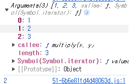

# [18장] 함수와 일급 객체

> 자바스크립트의 함수는 일급 객체로서, 독특한 특징을 가지고 있다. 이에 대해서 알아보자.

## 18.1 일급 객체란?

1. 무명의 리터럴로 생성할 수 있다. 즉, 런타임에 생성이 가능하다.
2. 변수나 자료구조(객체, 배열 등)에 저장할 수 있다.
3. 함수의 매개변수에 전달할 수 있다.
4. 함수의 반환값으로 사용할 수 있다.

자바스크립트 함수는 위 네 가지 조건을 모두 만족하기에 일급 객체로서의 함수다.

```javascript
// 1. 함수는 무명의 리터럴로 생성할 수 있다. (익명함수)
// 2. 함수는 변수에 저장할 수 있다.
// 또한, 런타임시에 생성이 이루어진다.
// 함수 표현식으로 작성을 하면, 식별자는 런타임 이전 호이스팅에 의해 최상단으로 옮겨진다.
//
const increase = function (num) {
  return ++num;
};

const decrease = function (num) {
  return --num;
};

// 2. 함수는 객체에 저장할 수 있다.
const auxs = { increase, decrease };

// 3. 함수의 매개변수에 전달할 수 있다.
["1", "2", "3"].forEach((elem) => console.log(elem));

// 4. 함수의 반환값으로 사용할 수 있다.
function makeCounter(aux) {
  let num = 0;

  return function () {
    num = aux(num);
    return num;
  };
}
```

따라서, 함수는 일반 객체를 사용하는 것과 똑같은 방법으로 사용이 가능하다!

## 18.2 함수 객체의 프로퍼티

`console.dir()` 을 통해, 함수 객체의 내부를 살펴보면 프로퍼티를 살펴볼 수 있다.
6개 프로퍼티가 존재하는데, 하나하나 씩 다루어 보자.

### 📝 arguments 프로퍼티

함수 객체의 arguments 프로퍼티는 값으로 arguments 객체를 가진다. 이 객체가 가진 것은 함수 호출 시 전달받은 인수들이다.
이전에 다룬 것 처럼, 이 인수들은 함수 내에서 지역변수처럼 사용되어 외부에서는 접근이 불가능하다.

```javascript
function multiply(x, y) {
  console.log(arguments); // 함수 내부에서 arguments 객체를 참조하면 된다.
  return x * y;
}

console.log(multiply()); // NaN
console.log(multiply(1)); // NaN
console.log(multiply(1, 2)); // 2
console.log(multiply(1, 2, 3)); // 2
```

인수 개수가 맞지 않더라도 자바스크립트는 오류를 만들지 않는다.

;

그리고, 개수를 초과한 인수일지라도 arguments 객체에 모두 저장되어있다!
또한, arguments 객체 내에는 iterator 가 존재해 순회하며 인수에 접근한다.

### 📝 caller 프로퍼티

자신을 호출한 함수를 가리킨다. 쓸 일은 없다고 한다.

```javascript
function foo(func) {
  return func();
}

function bar() {
  return "caller: " + bar.caller;
}

console.log(foo(bar)); // caller: function foo(func)
console.log(bar()); // caller: null
```

함수 `foo` 를 실행한 경우는 `bar` 를 인수로 받아 내부에서 호출했다.
반면, 그냥 `bar` 를 실행한 것은 함수 자체를 호출했기 때문에 null 을 출력한다.

### 📝 length 프로퍼티

함수를 정의할 때 선언했던 매개변수의 개수를 가리킨다.

```javascript
function foo() {}
console.log(foo.length); // 0

function bar(x) {}
console.log(bar.length); // 1

function bz(x, y) {
  console.log(arguments.length);
}

console.log(bz.length); // 2
bz(1, 2, 3); // 3
```

다만, `bz` 함수의 예시처럼 함수 내부의 arguments 객체 프로퍼티인 length 는 전달 받은 인수의 개수를 가리키는 것이니 주의하자!

### 📝 name 프로퍼티

함수의 이름을 가리킨다.
ES6 기준으로 명확히 말하자면, 함수 객체를 가리키는 **식별자**를 값으로 갖는다.

```javascript
var namedFunc = function foo() {};
console.log(namedFunc.name); // 함수 식별자가 foo 다! namedFunc 는 foo 를 참조하는 것.

var anonymousFunc = function () {};
console.log(anonymousFunc.name); // anonymouseFunc, 익명함수를 참조하는 경우.

function bar() {}
console.log(bar.name); // bar
```

### 📝 `__proto__` 접근자 프로퍼티

자바스크립트의 객체를 살펴보면, 모두 `[[Prototype]]` 라는 내부슬롯을 갖는다.
이는 프로토타입 객체로, 객체지향 프로그래밍의 핵심인 상속을 구현하는 역할이다.

`__proto__` 프로퍼티는 이 프로토타입 객체에 접근하기 위한 접근자 역할이다.

```javascript
const obj = { a: 1 };

console.log(obj.__proto__ === Object.prototype);
```

### 📝 prototype 프로퍼티
