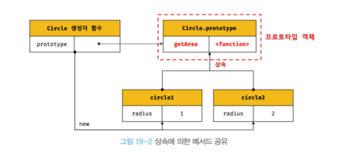
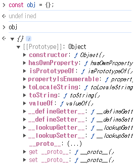
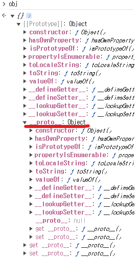
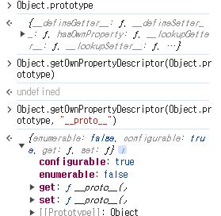

# [19장] 프로토타입

## 19.1 객체지향 프로그래밍

> 프로그램을 명령어 또는 함수의 목록으로 보는 시각은 전통적인 명령형 프로그래밍이다.
> 이런 절차지향적 관점에서 벗어나 여러 개의 독립적 단위인 객체의 집합으로 프로그램을 표현하는 방법론.

실제 세계에서 생물이나 사물이 다양한 특징을 갖듯이, 프로그램을 이루는 객체도 여러 속성을 가지게 만든 것이다.

예를 들면, 사람의 경우 이름이나 주소, 성별 또는 성격 처럼 다양한 특징을 갖는다.
이런 정보를 프로그램에 반영해 코드로 표현한다고 해보자.

```javascript
const person = {
  name: "KIM",
  gender: "male",
};
```

`person` 객체를 통해 사람을 추상화(abstraction)해보았다.

이번엔 반지름이 5인 원과 그 지름, 둘레와 넓이를 구하는 과정을 추상화 해보자.

```javascript
const circle = {
    radius: 5,

    getDiameter() {
        return 2 * radius;
    },

    getPerimeter() {
        return 2 * Math.PI = this.radius;
    },

    getArea() {
        return Math.PI * this.radius ** 2;
    }
};

console.log(circle);
console.log(circle.getDiameter());
```

객체는 단순 상태를 나타내는 값(프로퍼티) 부터, 다양한 동작(메서드)까지 하나로 묶은 복합적인 자료구조다.

## 19.2 상속과 프로토타입

> 상속(inheritance)는 객체지향 프로그래밍에 있어 핵심적인 개념이다. 한 객체의 프로퍼티와 메서드를 다른 객체가 그대로 이용할 수 있게 만들어준다.

자바스크립트에서는 프로토타입을 통해 상속을 구현해서 코드의 중복을 줄여주는 역할을 한다.
예시를 보고 이해해보자.

```javascript
function Cricle(radius) {
  this.radius = radius;
  this.getArea = function () {
    return Math.PI * this.radius ** 2;
  };
}

const circle1 = new Circle(1);
const circle2 = new Circle(2);

console.log(circle1.getArea === circle2.getArea); // ✨ false
```

위 예시를 보면, 같은 생성자 함수를 통해 생성한 두 개의 인스턴스가 가진 `getArea()` 메서드의 중복 생성이 이루어진다.
따라서, 같은 코드가 다른 메모리 공간에 하나 더 만들어진다..
여기 `Circle` 객체의 경우, `radius` 만 달라지기 때문에 메서드는 하나만 생성하는 것이 메모리 공간 점유를 줄일 수 있다!

이때, 프로토타입을 통해 `getArea()` 메서드를 상속받게 만들어준다.

```javascript
function Cricle(radius) {
  this.radius = radius;
}

Circle.prototype.getArea = function () {
  return Math.PI * this.radius ** 2;
};

const circle1 = new Circle(1);
const circle2 = new Circle(2);

console.log(circle1.getArea === circle2.getArea); // ✨ true
```

프로토타입을 통해 상속받도록 만들면, 두 인스턴스의 메서드는 같은 메모리 공간을 참조하게 만들 수 있다!
다시 말해, 중복 생성을 막을 수 있게 된다!



## 19.3 프로토타입 객체

앞서 다뤄본 것 처럼, 프로토타입은 객체지향 프로그래밍의 핵심인 상속을 구현하기 위해 자바스크립트에서 사용하는 방법이다.

모든 객체는 [[Prototype]] 이라는 내부 슬롯을 가지며, 이 내부 슬롯이 갖는 값은 앞서 다뤘던 그 프로토타입 객체다.

프로토타입의 값은 객체 생성 방식에 따라 달라지며, [[Prototype]] 에 저장된다.
예시로, 객체 리터럴로 생성한 경우 프로토타입은 다음과 같다.



이미 우리가 다룬 적 있는 프로퍼티들이 눈에 띈다.  
다만, 이 프로토타입을 가진 [[Prototype]] 내부 슬롯에 직접 접근할 수는 없지만
`__proto__` 프로퍼티를 통해 가능하다고 이야기했었다!



조금 더 자세히 보기 위해서, `Object` 자체에서 `__proto__` 프로퍼티를 살펴보자.



`get __proto__`, `set __proto__` 등의 접근자 함수가 눈에 띈다.
접근자 프로퍼티는 값을 갖는 것이 아니라 여기에 정의된 `get __proto__` 과 `set __proto__` 을 통해 [[Prototype]] 에 접근하고 값을 가져오는 것이다.

직접 `set __proto_` 를 호출해 값을 적용하는 것을 확인해보자.

```javascript
const obj = {};
const parent = { x: 1 };

// getter 함수인 get __proto__ 가 호출되고 obj 객체의 프로토타입을 가져옴
obj.__proto__;

// setter 함수인 set __proto__
obj.__proto__ = parent;

console.log(obj.x); // 1
```

그렇다면, 왜 `__proto__` 접근자를 이용하는 걸까?

```javascript
const parent = {};
const child = {};

// child 의 프로토타입은 parent 로
child.__proto__ = parent;

// parent 의 프로토타입은 child 로
parent.__proto__ = child; // TypeError: Cyclic __proto__ value
```

위 코드를 실행해보면, 결국 `child` 의 프로토타입은 `parent` 의 프로토타입으로 변경되었다.
여기에서 `child` 의 프로토타입을 `parent` 로 바꾸려고 시도하면, 스스로 자신을 프로토타입으로 삼는 문제가 발생한다.

이는 현재 `__proto__` 를 통해 프로토타입에 접근하면서, 프로토타입 체인이 단방향 링크드리스트와 유사한 구조가 되도록 점검하고 있기 때문에 오류를 만들어내는 것이다.

하지만, 이런 `__proto__` 프로퍼티를 직접 코드에서 사용하는 것은 권장하지 않는다.  
표준 사양에는 포함되었지만, 아래와 같은 경우는 접근자를 이용할 수 없기 때문이다.

```javascript
const obj = Object.create(null);

console.log(obj.__proto__); // undefined, Object.__proto__ 를 상속받지 못했다.

console.log(Object.getPrototypeOf(obj)); // null, 따라서 Object.getPrototypeOf() 메서드를 이용하면 가능하다.
```

대신, `Object.getPrototypeOf()` 메서드를 이용하면 된다.
이는 다른 객체의 프로토타입을 상속받게 만들어준다.

또는, 해당 객체의 프로토타입을 새로 설정하고 싶다면 `Object.setPrototypeOf()` 메서드를 사용하면 된다.

### 📝 함수 객체의 prototype 프로퍼티

함수 객체만이 소유하는 prototype 프로퍼티가 있다. [[Prototype]] 과 다르다!
이는 생성자 함수가 생성할 인스턴스의 프로토타입을 가리킨다.

```javascript
(function () {}).hasOwnProperty("prototype"); // true

({}).hasOwnProperty("prototype"); // false, 일반 객체는 가지지 않음.
```

그런데, 화살표 함수를 사용해 객체를 생성해보면 이는 생성자 함수로서 호출할 수 없기에 `prototype` 프로퍼티를 갖지 않는다!
