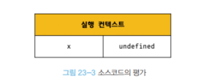
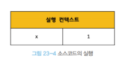
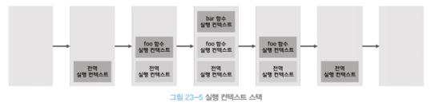

# [23장] 실행 컨텍스트

> 실행 컨텍스트는 자바스크립트의 동작 원리를 이해할 수 있는 개념이다!

## ✨ 23.1 소스코드의 타입

| 소스코드의 타입 | 설명                                                                    |
| --------------- | ----------------------------------------------------------------------- |
| 전역코드        | 전역에 존재하는 소스코드, 함수나 클래스 내부의 코드는 제외              |
| 함수 코드       | 함수 내부에 존재하는 코드, 중첩 함수나 클래스 내부 코드는 제외          |
| eval 코드       | 빌트인 전역 함수인 eval 함수에 인수로 전달되어 실행되는 소스코드        |
| 모듈 코드       | 모듈 내부의 소스코드, 모듈 내부에 정의된 함수나 클래스 내부 코드는 제외 |

이 네 가지 종류의 소스코드는 실행 컨텍스트를 생성한다.

1. 전역 코드

   - 전역 변수를 관리하기 위해 전역 스코프를 갖는다

2. 함수 코드

   - 함수 만의 지역 스코프를 생성한다. 이 스코프에서 지역 변수, 매개변수와 같은 arguments 객체를 관리한다. 또한, 전역 코드의 실행 컨텍스트와 스코프 체인으로 연결한다.

3. eval 코드

   - eval 코드는 strict mode(엄격 모드)에서 독립적인 스코프를 갖는다.

4. 모듈 코드
   - 모듈 별로 독립적인 스코프를 갖는다. 이를 위해 모듈 실행 컨텍스트가 생성된다.

## ✨ 23.2 소스코드의 평가와 실행

앞서 살펴본 소스코드들은 실행되기 전 '평가' 단계를 거친 뒤 '실행'된다.
먼저, 평가 과정에서는 실행 컨텍스트를 생성하고 변수 그리고 함수 선언문을 먼저 실행 컨텍스트의 스코프에 등록한다.

평가 이후, 소스코드의 실행이 시작된다. 이 때, 앞서 실행 컨텍스트에 담긴 정보인 스코프를 통해 필요한 변수나 함수 또는 객체를 참조하게 된다.
코드 실행 후의 결과 또한 실행 컨텍스트에 반영된다!

```javascript
var x;
x = 1;
```

위 코드를 실행한다고 가정해보자.



먼저, 소스코드 평가 과정에서 호이스팅이 일어나고 `var` 키워드로 선언한 변수 `x` 는 런타임 이전에 `undefined` 로 초기화 된다.

이후 실행 과정에서 `x` 에 `1`이 할당 된다.



## ✨ 23.3 실행 컨텍스트의 역할

```javascript
const x = 1;
const y = 2;

function foo(a) {
  const x = 10;
  const y = 20;

  console.log(a + x + y); // 130
}

foo(100);

console.log(x + y); // 3
```

위 예시는, 전역 환경에서 변수와 함수 선언문을 정의한 상황이다.
코드의 평가와 실행이 이루어지는 과정을 살펴보자.

1. 전역 코드 평가

   - 코드 평가 시에는, 변수 선언문과 함수 선언문만 먼저 평가되어 실행 컨텍스트의 전역 스코프에 등록된다.

2. 전역 코드 실행

   - 전역 코드 평가 과정이 끝나면, 런타임에서 실행 컨텍스트의 정보를 가지고 코드 실행이 이루어진다.

3. 함수 코드 평가

   - 함수 내부에 정의된 것들의 평가가 이루어 진다. arguments 객체도 이때 생성되며 실행 컨텍스트의 지역 스코프에 등록된다.

4. 함수 코드 실행
   - 함수 내부의 코드의 평가가 끝난 후, 실행이 된다.
   - 함수 내부에서 `console.log()` 를 실행하기 위해서 스코프 체인을 통해 검색한 뒤 `(a+x+y)` 식이 평가 된다. 이후 콘솔에 값을 출력한 뒤 함수가 종료된다.
   - 함수 종료 후에는 호출 이전의 상태로 다시 돌아가 전역 공간의 코드를 실행한다.

함수가 종료된 뒤, 이전 상태로 돌아가려면 실행 컨텍스트 내에 변수나 함수의 식별자 정보, 스코프, 코드 실행 순서까지도 담고 있어야 한다.

식별자와 스코프 정보는 **렉시컬 환경**, 코드 실행 순서는 **실행 컨텍스트 스택**을 통해 관리한다!

## ✨ 23.4 실행 컨텍스트 스택

```javascript
const x = 1;

function foo() {
  const y = 2;

  function bar() {
    const z = 3;
    console.log(x + y + z);
  }

  bar();
}

foo(); // 6
```

위 예시 코드 또한 전역 코드와 함수 코드로 이루어져있다.

코드 실행 순서에 따라, 실행 컨텍스트가 추가 / 삭제 되며 스택 구조로 관리된다.



자세한 코드 실행 순서는 아래와 같다.

1. 전역 코드의 평가와 실행

   - 전역 변수 `x` 와 전역 함수 `foo()` 는 전역 스코프로 실행 컨텍스트에 등록된다.

2. foo 함수 코드의 평가와 실행

   - 전역 함수 `foo()` 가 호출 되면 전역 코드의 실행은 일시 중단 되고, 코드의 제어권은 `foo()` 함수로 이동한다. 이때 함수 내부의 코드가 평가 되며 실행 컨텍스트 스택에 추가 된다. 이후 코드 실행이 되며 `bar()` 의 실행이 이루어진다.

3. bar 함수 코드의 평가와 실행

   - 중첩 함수 `bar()` 또한 호출 되면 내부의 코드가 평가되면서 제어권이 `bar()` 로 이동한다. 마찬가지로 실행 컨텍스트 스택에 추가되고 내부 코드 실행이 된다.

4. foo 함수 코드로 복귀

   - `bar()` 함수가 종료되면서 실행 컨텍스트 스택에서 `bar()` 가 사라진다. 그 다음, 스택에 `foo()` 가 여전히 남아있기에 복귀하게 되지만 `foo()` 역시 모든 내부 코드를 실행했기에 종료된다.

5. 전역 코드로 복귀
   - `foo()` 가 실행 컨텍스트 스택에서 사라지고, 스택의 최하단인 전역 공간으로 복귀한다. 하지만 모든 코드가 실행되었기에 실행 컨텍스트 스택에는 아무것도 남아있지 않게 된다.

## ✨ 23.5 렉시컬 환경

렉시컬 환경(Lexical Environment)은 식별자와 식별자에 바인딩된 값, 상위 스코프에 대한 참조가 가능하도록 정보를 가지는 요소다.

실행 컨텍스트는 3가지 정보를 갖는 객체다.

1. VariableEnvironment, VE

2. LexcialEnvironment, LE

3. This binding

`this binding` 에 대해서는 22장에서 다루었고, 우리가 눈 여겨볼 것은 VE와 LE다.

VE, LE 공통적으로 갖는 요소가 있는데,

- 환경 레코드(Environment Record): 스코프에 포함된 식별자와 바인딩된 값 관리
- 외부 렉시컬 환경에 대한 참조(Outer Lexical Environment Reference): 스코프 체인 구현을 위해 상위 스코프의 렉시컬 환경을 참조한 정보

VE의 경우, 실행 컨텍스트가 생성되는 시점의 snapshot이다.
다시 말해, 생성 되는 시점의 정보만을 갖는다.

LE 의 경우에는, snapshot 을 기반으로 생성되어 변화가 생길 때 마다 이를 기록하는 저장소 역할이다.

## ✨ 23.6 실행 컨텍스트의 생성과 식별자 검색 과정

아래 코드가 실행되면서 어떻게 실행 컨텍스트가 생성되고 식별자 검색이 이루어지는 과정까지 살펴보자.

```javascript
var x = 1;
const y = 2;

function foo(a) {
  var x = 3;
  const y = 4;

  function bar(b) {
    const z = 5;
    console.log(a + b + x + y + z);
  }
  bar(10);
}

foo(20); // 42
```

### 📝 전역 객체 생성

전역 객체는 전역 공간의 코드가 평가되기 전에 앞서 생성된다.
이후, 평가되면서 변수나 함수 또는 객체들이 전역 객체의 프로퍼티로 추가된다.

이외에도, 전역 객체에는 각종 빌트인 객체나 함수, 프로퍼티 등이 추가된다.
그리고 `Object.prototype` 을 상속 받는다.

### 📝 전역 코드 평가

코드 평가가 진행되면서 아래 과정이 순차적으로 이루어진다.

1. 전역 실행 컨텍스트 생성

2. 전역 렉시컬 환경 생성
   - 전역 환경 레코드 생성
     - 객체 환경 레코드 생성
     - 선언적 환경 레코드 생성
   - this binding
   - 외부 렉시컬 환경에 대한 참조 결정

이 과정을 보다 자세하게 살펴보도록 하자.

#### 💼 전역 실행 컨텍스트 생성


비어있는 전역 실행 컨텍스트를 생성한 뒤, 실행 컨텍스트 스택에 추가한다.

#### 💼 전역 렉시컬 환경 생성

실행 컨텍스트 스택에 추가된 전역 실행 컨텍스트에 렉시컬 환경이 추가된다.

이때, 환경 코드와 외부 렉시컬 환경에 대한 참조가 추가되는 것이다.

##### 전역 환경 레코드 생성

전역 환경 레코드는 전역 변수를 관리하는 역할이다.
전역 스코프 부터 빌트인 함수나 객체등을 제공하는 역할도 한다.

하지만, 여기서 `var` 키워드로 선언 한 경우와 `let`, `const` 로 선언한 경우가 달라진다. 전역 환경 레코드는 다시 하위 개념으로 분리가 되어 관리하기 때문이다.

- 객체 환경 레코드: `var` 로 선언한 전역 변수와 함수 선언문으로 정의한 전역 함수, 각종 빌트인 관리.  
  전역 환경 레코드에 존재하는 `BindingObject` 라는 전역 객체와 연결되어 전역 객체에 프로퍼티나 메서드로 등록 된다.

- 선언적 환경 레코드: `let`, `const` 로 선언한 전역 변수  
  앞서, 호이스팅에 대해 다루면서 `let` 이나 `const` 는 호이스팅의 대상이 되지 않는 것처럼 만드는 방법은 `undefined` 로 초기화를 막고 TDZ(Temporal Dead Zone)에 격리하는 방법을 사용한다고 했다.

선언적 환경 레코드가 TDZ 라고 생각하면 된다!

#### 💼 this binding

전역 환경 레코드의 [[GlobalThisValue]] 내부 슬롯에 this binding 이 된다.
지금은 전역 환경이기에, 브라우저 환경에서는 `window` 가 전역 객체가 될 것이다.

따라서, 전역 객체에서 `this` 를 참조하면 [[GlobalThisValue]] 에 저장된 `this`인 전역 객체를 참조하게 된다.

#### 💼 외부 렉시컬 환경에 대한 참조 결정

현재 평가하는 중인 소스코드를 포함하며, 상위 스코프의 렉시컬 환경까지 참조한다.
다만, 전역 환경이기에 상위 스코프는 없으며 `null` 이 할당 된다.
이는 전역 렉시컬 환경이 스코프 체인의 종점임을 나타내준다!

### 📝 전역 코드 실행

위에 적어둔 전역 코드들이 드디어 실행이 된다.
지금까지의 내용을 읽으면서 아마 어떤 코드였는지 기억도 안날 것이다.

```javascript
var x = 1;
const y = 2;

function foo(a) {
  var x = 3;
  const y = 4;

  function bar(b) {
    const z = 5;
    console.log(a + b + x + y + z);
  }
  bar(10);
}

foo(20); // 42
```

위의 코드들이 실행된다.

전역 변수가 할당 되고, `foo()` 함수가 호출된다.

이어서, 실행 컨텍스트 스택에 추가되어있는 실행 컨텍스트들의 렉시컬 환경 레코드를 통해 어디에 `foo` 식별자가 존재하는지, 어떤 `foo` 를 참조할 지 결정하게 된다.

지금 예시에서는 전역 환경에만 유일하게 존재하기에 금방 알아차릴 수 있을 것이다.

### 📝 `foo` 함수 코드 평가

이제는 함수 내부의 코드가 평가되어 지역 환경의 실행 컨텍스트가 만들어 진다.
