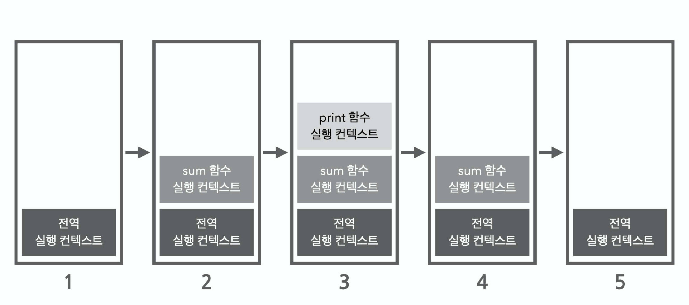
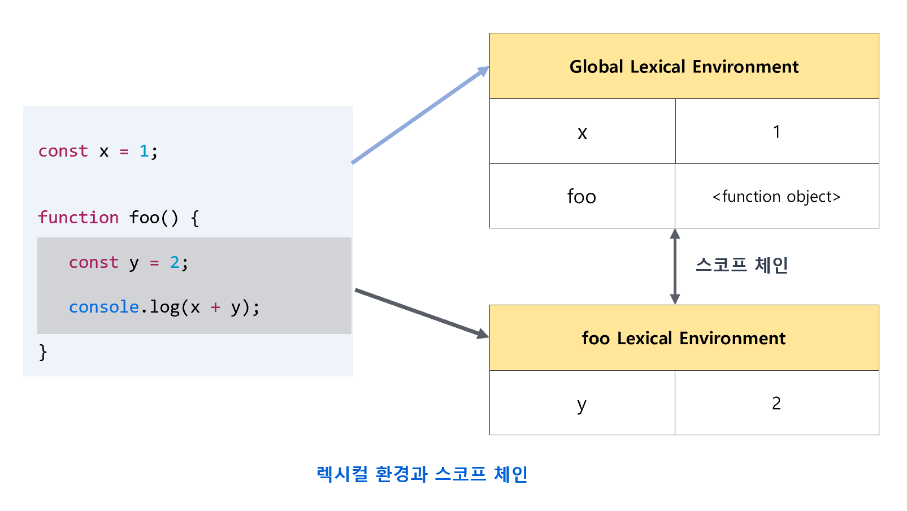
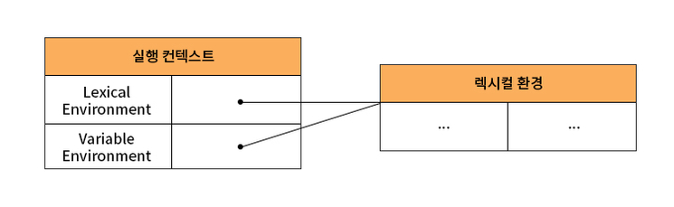
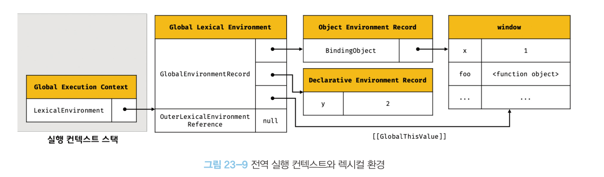
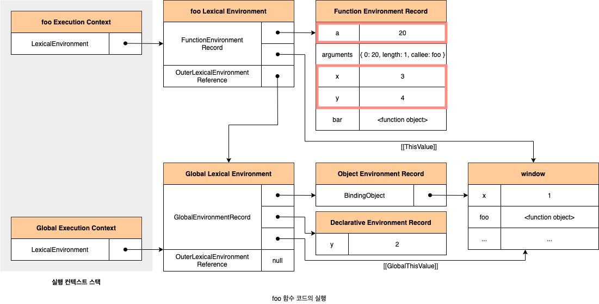
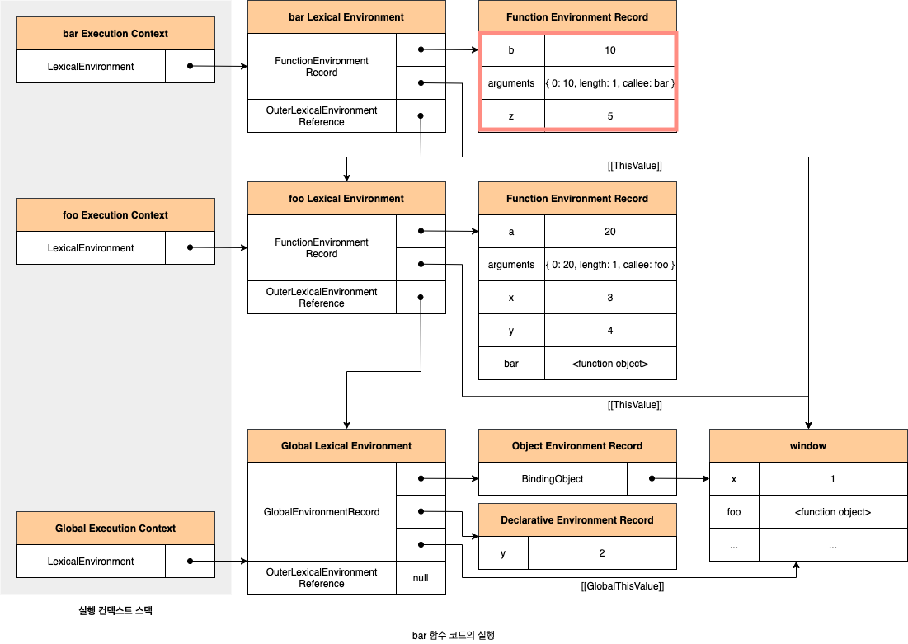

# 23장 실행 컨텍스트

실행 컨텍스트는 자바스크립트의 동작 원리를 담고 있는 핵심 개념이다.

<br/>

## 23.1 소스코드의 타입

ECMAScript 사양은 소스코드를 4가지 타입으로 구분한다.  
소스코드 타입 | 설명
:-------: | :-------:
전역코드 | 전역에 존재하는 소스 코드. (전역에 정의된 함수, 클래스 등의 내부 코드 포함하지 않음) |
함수 코드 | 함수 내부에 있는 코드. (함수 내부에 중첨된 함수, 클래스 등의 내부 코드 포함하지 않음) |
eval 코드 | 빌트인 전역 함수인 eval함수에 인수로 전달되어 실행되는 소스코드 |
모듈 코드 | 모듈 내부에 존재하는 소스코드 말한다.(모듈 내부 함수, 클래스 내부 코드는 포함하지 않는다.)

이렇게 구분하는 이유는 소스코드 타입에 따라 실행 컨텍스트를 생성하는 과정과 관리 내용이 다르기 때문이다.

<br/>

#### 1. 전역 코드

전역 변수를 관리하기 위해 최상위 스코프인 전역 스코프를 생성해야 한다.  
var 키워드로 선언된 전역 변수와 함수 선언문으로 정의된 전역 함수를 전역 객체의 프로퍼티와 메서드로 바인딩하고 참조하기 위해 전역 객체와 연결되어야 한다.

<br/>

#### 2. 함수 코드

지역 스코프를 생성하고 지역 변수, 매개변수, arguments 객체를 관리해야 한다.  
생성한 지역 스코프를 전역 스코프에서 시작하는 스코프 체인의 일원으로 연결해야 한다.

<br/>

#### 3. eval함수

strict mode에서 자신만의 독자적인 스코프를 생성한다.

<br/>

#### 4. 모듈 코드

모듈별로 독립적인 모듈 스코프를 생성한다.

<br/>

## 23.2 소스코드의 평가와 실행

모든 소스코드는 실행에 앞서 평가 과정을 거치며 코드를 실행하기 위한 준비를 한다.

소스코드 평가 과정에서는 실행 컨텍스트를 생성하고 변수, 함수 등의 선언문만 먼저 실행하여 생성된 변수나 함수 식별자를 키로 실행 컨텍스트가 관리하는 스코프(렉시컬 환경의 레코드)에 등록한다.

<br/>

## 23.3 실행 컨텍스트의 역할

#### 1. 전역 코드 평가

전역 코드 실행하기 전 평가 과정 거치며 선언문만 먼저 실행한다. => 생성된 전역 변수와 전역 함수가 실행 컨텍스트가 관리하는 전역 스코프에 등록된다.  
 이때 var 키워드로 선언된 전역 변수와 함수 선언문으로 정의된 전역 함수는 전역 객체의 프로퍼티와 메서드가 된다.

#### 2. 전역 코드 실행

평가 과정이 끝나면 런타임이 시작된다. 이때 전역 변수에 값 할당되고 호출된다.

#### 3. 함수 코드 평가

함수 내부로 진입하면 함수 코드 평가 과정을 거치며 함수 코드를 실행하기 위한 준비를 한다. 이때 매개변수와 지역 변수 선언문이 먼저 실행되고 지역 스코프에 등록된다.  
 또, 함수 내부에서 지역 변수처럼 사용할 수 있는 arguments 객체가 생성되어 등록되고 this 바인딩도 결정된다.

#### 4. 함수 코드 실행

함수 코드가 순차적으로 실행되고 매개변수와 지역변수에 값이 할당된다.  
 식별자는 스코프 체인을 통해 검색한다.

이처럼 코드가 실행되려면 스코프를 구분하여 식별자와 바인딩된 값이 관리되어야 한다.  
**스코프, 식별자, 코드 실행 순서 이 모든 것을 관리하는 것이 실행 컨텍스트이다.**

실행 컨텍스트는 소스코드 실행하는 데 필요한 환경을 제공하고 코드의 실행 결과를 실제로 관리하는 영역이다.

<br/>

## 23.4 실행 컨텍스트 스택

코드가 실행되는 시간의 흐름에 따라 실행 컨텍스틑 스택에는 실행 컨텍스트가 추가되고 제거된다.  

실행 컨텍스트 스택은 코드의 실행 순서를 관리한다. 스택의 최상위에 존재하는 실행 컨텍스트는 언제나 현재 실행 중인 코드의 실행 컨텍스트이다.

<br/>

## 23.5 렉시컬 환경

렉시컬 환경은 식별자와 식별자에 바인딩된 값, 그리고 상위 스코프에 대한 참조를 기록하는 자료구조로 실행컨텍스트를 구성하는 컴포넌트이다.  
실행컨텍스트가 코드 실행 순서를 관리한다면 렉시컬 환경은 스코프와 식별자를 관리한다.  


렉시컬 환경은 키와 값을 갖는 객체 형태의 스코프를 생성하여 식별자를 키로 등록하고 식별자에 바인딩된 값을 관리한다.  
실행 컨텍스트는 `LexicalEnvironment` 컴포넌트와 `VariableEnvironment` 컴포넌트로 구성된다.


렉시컬 환경은 두 개의 컴포넌트로 구성된다.

#### 1. 환경 레코드 (EnvironmentRecord)

스코프에 포함된 식별자를 등록하고 등록된 식별자에 바인딩된 값을 관리하는 저장소.  
 환경 레코드는 소스코드 타입에 따라 관리하는 내용에 차이가 있다.

#### 2. 외부 렉시컬 환경에 대한 참조 (OuterLexicalEnvironmentReference)

상위 스코프를 가리킨다.

<br/>

## 23.6 실행 컨텍스트의 생성과 식별자 검색 과정

```js
var x = 1;
const y = 2;

funciton foo(a){
    var x = 3;
    const y = 4;

    function bar(b){
        const z = 5;
        console.log(a + b + x + y + z);
    }
    bar(10)
}
foo(20)
```

위의 코드에 대한 예제를 살펴보자.

### 23.6.1 전역 객체 생성

전역 객체도 `Object.prototype`을 상속받는다. => 전역 객체도 프로토타입 체인의 일원이다.

<br/>

### 23.6.2 전역 코드 평가

전역 코드 평가는 다음과 같은 순서로 진행된다.

1. 전역 실행 컨텍스트 생성
2. 전역 렉시컬 환경 생성
   1. 전역 환경 레코드 생성
      1. 객체 환경 레코드 생성
      2. 선언적 환경 레코드 생성
   2. this 바인딩
   3. 외부 렉시컬 환경에 대한 참조 결정



<br/>

### 23.6.3 전역 코드 실행

변수 할당문 또는 함수 호출문을 실행하려면 먼저 변수 또는 함수 이름이 선언된 식별자인지 확인해야 한다.

<br/>

### 23.6.4 foo 함수 코드 평가

함수 코드 평가는 아래 순서대로 진행한다.

1. 함수 실행 컨텍스트 생성
2. 함수 렉시컬 환경 생성
   1. 함수 환경 레코드 생성
   2. this 바인딩
   3. 외부 렉시컬 환경에 대한 참조 결정

### 23.6.5 foo 함수 코드 실행



<br/>

### 23.6.6 bar 함수 코드 평가

foo 함수 코드 평가와 동일하다.

<br/>

### 23.6.7 bar 함수 코드 실행

런타임이 시작되어 매개변수 인수 할당되고, 변수 할당문이 실행된다.



<br/>

### 23.6.8 bar 함수 코드 실행 종료

bar함수 실행 컨텍스트가 팝되어 제거되고 foo 실행 컨텍스트가 실행 중인 실행 컨텍스트가 된다.  
bar함수 실행 컨텍스트가 제거되었다고 해서 렉시컬 환경까지 즉시 소멸하는 것은 아니다. 렉시컬 환경은 실행 컨텍스트에 참조되기는 하지만 독립적인 객체다.  
누군가에 의해 참조되지 않을 때 비로소 가비지 컬렉터에 의해 메모리 공간의 확보가 해제되어 소멸한다.

<br/>

### 23.6.9 foo 함수 코드 실행 종료

foo 함수 실행 컨텍스트가 팝되어 제거되고 전역 실행 컨텍스트가 실행 중인 실행 컨텍스트가 된다.

<br/>

### 23.6.10 전역 코드 실행 종료

foo 함수가 종료되면 더는 실행할 전역 코드가 없으므로 전역 코드의 실행이 종료되고 전역 실행 컨텍스트도 실행 컨텍스트 스택에서 팝되어 실팽 컨텍스트 스팩에는 아무것도 남아있지 않게 된다.

## 23.7 실행 컨텍스트와 블록 레벨 스코프

`var` 키워드로 선언한 변수는 오로지 함수의 코드 블록만 지역 스코프로 인정하는 **함수 레벨 스코프**를 따른다. 하지만 `let, const` 키워드로 선언한 변수는 모든 코드 블록을 지역 스코프로 인정하는 **블록 레벨 스코프**를 따른다.
