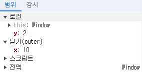

# [24장] 클로저

> 드디어 클로저

## 클로저란?

`함수 자체 + 함수가 선언된 렉시컬 환경` 이라고 이해할 수 있다.

하지만 이게 잘 와닿지 않으니 다시 살펴보자

```javascript
const x = 1;

function outerFunc() {
  const x = 10;

  function innerFunc() {
    console.log(x); // 10
  }

  innerFunc(); // 10
}

outerFunc();
```

`outerFunc()` 를 실행하면, `innerFunc()`가 호출되면서 `outerFunc()` 내에 정의된 `x` 에 접근해 `10` 을 출력한다.

`innerFunc()` 를 호출해도 `outerFunc()` 의 변수에 접근할 수 있는 이유는 렉시컬 스코프를 따르는 프로그래밍 언어기 때문!

## ✨ 24.1 렉시컬 스코프

자바스크립트 엔진은 함수를 어디서 호출했는지가 아니라, 어디에 정의했는지에 따라 상위 스코프를 결정한다.

이것이 렉시컬 스코프!

다른 예시 코드를 보자.

```javascript
const x = 1;

function foo() {
  const x = 10;
  bar();
}

function bar() {
  console.log(x);
}

foo(); // 1
bar(); // 1
```

위 코드는 `foo()` 를 호출 하든지 `bar()` 를 호출하든지, 모두 `1` 을 출력한다.

`bar()` 는 전역 공간에 정의한 상태이기 때문에, 상위 스코프는 전역 공간이기 때문이다.

현재 스코프에서 상위 스코프가 어떤 것인지 알 수 있는 이유는, 앞서 다뤘듯이 실행 컨텍스트의 렉시컬 환경에서 `외부 렉시컬 환경에 대한 참조` 를 통해 렉시컬 스코프를 갖기 때문이다.

## 24.2 ✨ 함수 객체의 내부 슬롯 [[Environment]]

> 함수는 자신의 내부 슬롯 [[Environment]]에 상위 스코프 참조 정보를 담고 있다.

[[Environment]] 에 값이 저장되는 시점은, 함수 정의가 평가되어 객체 생성이 이루어질 때다.

```javascript
const x = 1;

function foo() {
  const x = 10;
  bar();
}

function bar() {
  console.log(x);
}

foo(); // 1
bar(); // 1
```

그래서, `foo()` 와 `bar()` 의 결과가 동일했던 것이다.
함수 정의가 평가되는 시점에 [[Environment]] 가 정해지기 때문에 두 함수 모두 전역 렉시컬 환경을 참조하게 된다.

```javascript
const x = 1;

function outerFunc() {
  const x = 10;

  function innerFunc() {
    console.log(x); // 10
  }

  innerFunc(); // 10
}

outerFunc();
```

`outerFunc()` 내부에 정의한 `innerFunc()` 역시,
`outerFunc()` 의 정의가 평가되면서 `innerFunc()` 의 평가가 진행된다.

이때, `outerFunc()` 의 내부에 있기 때문에 [[Environment]] 에는 `outerFunc()` 의 렉시컬 환경을 참조한 값이 들어있는 것이다!

렉시컬 스코프의 실체가 이것이다.

## ✨ 24.3 클로저와 렉시컬 환경

```javascript
const x = 1;

//
function outer() {
  const x = 10;

  // 중첩 함수 inner 정의
  const inner = function () {
    console.log(x);
  };

  // 반환
  return inner;
}

// outer 함수를 호출하면 중첩함수 inner 반환
const innerFunc = outer();

innerFunc(); // 10;
```

위 예시에서, `outer()` 로 호출한 뒤 동작이 끝나면 실행 컨텍스트 스택에서 제거 된다.

그럼에도 `innerFunc()` 의 동작이 `outer()` 와 같은 이유는 무엇일까?

렉시컬 환경등의 정보는 유효한 것 처럼 보인다.
다시 말해 `outer()` 실행 컨텍스트가 제거 되었는데 `outer()` 의 변수를 참조할 수 있다.

여기에서 클로저가 등장한다.

클로저는 함수 + 함수의 렉시컬 환경 이라고 생각하면 된다.

`inner()` 는 함수 표현식이라 런타임에 [[Enviroment]] 가 참조하는 값이 정해지지만,
런타임 시에도 외부 스코프는 `outer()` 로 동일하다.

`outer()` 가 종료한 뒤, `outer()` 의 실행 컨텍스트가 사라지더라도 참조 가능한 이유는 *`inner()` 에서 렉시컬 스코프를 통해 `outer()` 의 렉시컬 환경을 참조*하고 있기 때문에 가비지 컬렉팅 대상에서 벗어나기 때문이다.

`outer()` 의 실행 컨텍스트는 사라지고 `inner()` 가 참조하는 상황에서 `inner()` 를 클로저라고 부른다.

중첩 함수로 정의한 `inner()` 가 먼저 종료한 `outer()` 를 참조하면서, 변수에 접근하고 수정까지도 가능한 특별한 상황이기 때문이다.

사실 모든 함수는 렉시컬 스코프가 있기에 모든 함수는 클로저라고 할 수 있다.
하지만, 방금 같은 특수한 상황이 아니면 클로저라고 부르지 않는다.

아래 예시를 보자.

```javascript
function outer() {
  const x = 10;

  // 중첩 함수 inner 정의
  const inner = function () {
    const y = 2;

    console.log(y);
  };

  // 반환
  return inner;
}

// outer 함수를 호출하면 중첩함수 inner 반환
const innerFunc = outer();

innerFunc(); // 2;
```

현재, `inner()` 를 `outer()` 내부에 정의했고 `outer()` 의 실행이 종료되었지만
`innerFunc` 에 `inner()` 가 할당된 상황이다.

하지만 이때, `inner()` 는 `outer()` 보다 오래 생존했지만 `inner()` 는 상위 스코프의 변수를 참조하지 않고 있다.

따라서, 이때 `inner()` 는 클로저라고 부르지는 않는다.

```javascript
function outer() {
  const x = 10;
  const y = 100;

  // 중첩 함수 inner 정의
  const inner = function () {
    const y = 2;
    debugger;
    console.log(x, y); // ✨ 상위 스코프의 변수도 참조하도록 설정.
  };

  // 반환
  return inner;
}

// outer 함수를 호출하면 중첩함수 inner 반환
const innerFunc = outer();

innerFunc(); // 10, 2;
```

예시를 조금 변경해, 중첩 함수에서 상위 스코프의 변수를 참조하도록 변경했다.

`debugger` 를 추가한 뒤 콘솔에서 확인해보면, 클로저가 참조하는 변수를 확인할 수 있다.



현재, `y` 는 `inner()` 스코프에 정의한 변수가 있기 때문에
클로저가 참조하는 변수는 상위 스코프의 `x` 만 해당한다.

이 클로저를 어떻게 활용하는지 살펴 보자.

## ✨ 24.4 클로저의 활용
