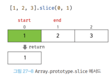

# [27장] 배열

## 27.1 배열이란?

> 여러 개의 값을 순차적으로 나열한 자료구조인 배열에 대해서 알아보자.

배열 리터럴을 통해 배열을 생성해보자.

```javascript
const arr = ["apple", "banana", "orange"];
```

이렇게 생성한 배열에 저장된 값들('apple', 'banana', 'orange')은 각각 "요소(Element)"라고 부른다.

자바스크립트의 모든 값은 배열의 요소가 될 수 있다!
원시값 부터 함수 및 객체까지!

그리고, 배열의 각 요소들은 자신의 위치를 나타내는 0 이상의 정수인 "인덱스(index)"를 갖는다.

인덱스를 사용해 배열의 요소에 접근하는 방법은 다음과 같다.

```javascript
arr[0]; // "apple"
arr[1]; // "banana"
arr[2]; // "orange"
```

배열의 모든 요소의 개수를 나타내는 `length` 프로퍼티가 존재한다.

```javascript
console.log(arr.length); // 3
```

이를 활용해, 배열의 모든 요소에 for 문을 통해 순차적으로 접근할 수 있다.

```javascript
for (let i = 0; i < arr.length; i++) {
  console.log(arr[i]);
}
```

앞서 살펴본 배열 리터럴을 통한 생성 방법 이외에도 다양한 생성법이 있다.

1. Array 생성자 함수
2. Array.of
3. Array.from

배열의 생성자 함수는 Array 이며, 프로토타입은 Array.prototype 이다.

```javascript
const arr = [1, 2, 3];

arr.constructor === Array; // true
Object.getPrototypeOf(arr) === Array.prototype; // true
```

배열은 객체지만 일반 객체와 구별되는 독특한 특징이 있다.

| 구분            | 객체                      | 배열          |
| --------------- | ------------------------- | ------------- |
| 구조            | 프로퍼티 키와 프로퍼티 값 | 인덱스와 요소 |
| 값의 참조       | 프로퍼티 키               | 인덱스        |
| 값의 순서       | X                         | O             |
| length 프로퍼티 | X                         | O             |

객체와 달리 배열이 가진 차이는, 요소가 순서를 갖는 점과 `length` 프로퍼티로 요소의 개수를 알 수 있다는 점이다.

## 27.2 자바스크립트 배열은 배열이 아니다

다른 프로그래밍 언어나, 자료구조 관점에서 배열은 메모리 공간의 빈틈 없이 연속적으로 나열된 자료구조를 말한다.
이런 형태의 배열을 밀집 배열(Dense Array)라고 한다.

그러나, 자바스크립트 배열은 일반적인 배열의 동작을 흉내낸 특수한 객체다.
자바스크립트 배열의 요소는 사실 객체의 프로퍼티 값에 해당하는 것이다.

일반적인 배열과 자바스크립트 배열의 장단점을 정리해보자.

- 일반적인 배열은 인덱스로 요소에 빠르게 접근할 수 있다. 하지만 요소를 삽입 또는 삭제하는 경우에는 효율적이지 않다.
- 자바스크립트 배열은 해시 테이블로 구현된 객체이므로 인덱스로 요소에 접근하는 경우 일반적인 배열보다 성능적인 면에서 느릴 수 밖에 없는 구조적 단점이 있다.
- 하지만 요소를 삽입 또는 삭제하는 경우에는 일반적인 배열보다 빠른 성능을 기대할 수 있음

## 27.3 length 프로퍼티와 희소 배열

length 프로퍼티는 요소의 개수, 즉 배열의 길이를 나타내는 0 이상의 정수를 값으로 가짐.
length 프로퍼티의 값은 빈 배열일 경우 0이며, 빈 배열이 아닐 경우 가장 큰 인덱스에 1을 더한 값과 같음.

```javascript
[].length[(1, 2, 3)].length; // 0 // 3
```

length 의 값은 0 <= length < 2^32 -1 범위의 정수다.

배열에 요소를 추가하거나 삭제하면 자동 갱신된다.

length 프로퍼티 값은 변경되지만 실제로 배열의 길이가 늘어나지 않는다.

배열이 가진 length 프로퍼티 값보다 작은 숫자 값을 할당하면 배열의 길이가 줄어든다.

```javascript
const arr = [1, 2, 3, 4, 5];

arr.length = 3;

console.log(arr); // [1, 2, 3]
```

이와 달리 length 프로퍼티 값보다 큰 숫자 값을 할당하는 경우에는 length 프로퍼티 값은 변경되지만 실제로 배열의 길이가 늘어나지는 않는다.

```javascript
const arr = [1];

arr.length = 3;

console.log(arr.length); // 3
console.log(arr); // [1]
```

자바스크립트에서는 이렇게 빈 요소를 위해 공간을 확보하지 않으며 빈 요소를 생성하지 않는다.

희소배열은, 다음과 같은 예시를 보자.

```javascript
const abc = [];

abc[0] = 1;
abc[2] = 2;

console.log(abc); // (3) [1, 비어 있음, 2]
```

`abc[1]` 에 해당하는 부분이 비어있어도 전혀 문제가 없다.

하지만, 이런 희소 배열은 권장하지 않고 연속적으로 위치시키는 것이 최선이다.

## 27.4 배열 생성

### 📝 배열 리터럴

```javascript
const arr = [1, 2, 3];
console.log(arr.length); // 3
```

배열 리터럴에 요소를 하나도 추가 하지 않으면, 빈 배열이 된다.

```javascript
const arr = [];
console.log(arr.length); // 0
```

아래 처럼 희소 배열을 생성할 수 있다.

```javascript
const arr = [1, , 3];

console.log(arr.length); // 3
console.log(arr); // [1, empty, 3]
console.log(arr[1]); // undefined
```

`arr[1]` 에는 어떤 값도 할당하지 않았기 때문에 `undefined` 가 된다.

### 📝 Array 생성자 함수

Object 생성자 함수를 통해 객체를 생성할 수 있듯이 Array 생성자 함수를 통해 배열을 생성할 수 있다.
Array 생성자 함수는 전달된 인수의 개수에 따라 다르게 동작하므로 주의가 필요함.

### 📝 Array.of

ES6 에서 도입된 Array.of 메서드는 전달된 인수를 요소로 갖는 배열을 생성.
Array.of 는 Array 생성자 함수와 전달된 인수가 1개이고 숫자더라도 인수를 요소로 갖는 배열을 생성한다.

```javascript
Array.of(1); // [1]

Array.of(1, 2, 3); // [1, 2, 3]

Array.of("string"); // ['string']
```

### 📝 Array.from

Array.from 메서드는 유사 배열 객체(array-like object) 또는 이터러블 객체(iterable object)를 인수로 전달받아 배열로 변환하여 반환한다.

```javascript
Array.from({ length: 2, 0: "a", 1: "b" }); // ['a', 'b']

Array.from("Hello"); // ['H', 'e', 'l', 'l', 'o']
```

Array.from 을 사용하면 두 번째 인수로 전달한 콜백 함수를 통해 값을 만들면서 요소를 채울 수 있다.
Array.from 메서드는 두 번째 인수로 전달한 콜백 함수의 첫 번째 인수에 의해 생성된 배열의 요소값과 인덱스를 순차적으로 전달하면서 호출하고, 콜백 함수의 반환값으로 구성된 배열을 반환한다.

```javascript
// Array.from 에 length 만 존재하는 유사 배열 객체를 전달하면 undefined 를 요소로 채운다.
Array.from({ length: 3 }); // [undefined, undefined, undefined]

// Array.from 은 두 번째 인수로 전달한 콜백 함수의 반환ㄱ
Array.from({ length: 3 }, (_, i) => i); // [0, 1, 2]
```

## 27.5 배열 요소의 참조

배열의 요소를 참조할 때 대괄호([]) 표기법을 사용한다.
대괄호 안에는 인덱스를 넣어준다.

```javascript
const arr = [1, 2];

console.log(arr[0]); // 1

console.log(arr[3]); // undefined
```

존재하지 않는 요소에 접근하면 undefined 가 반환된다.

## 27.6 배열 요소의 추가와 갱신

객체에 프로퍼티를 동적으로 추가할 수 있는 것처럼 배열에도 요소를 동적으로 추가할 수 있다.
존재하지 않는 인덱스를 사용해 값을 사용하면 새로운 요소가 추가된다. 이때 length 프로퍼티 값은 자동 갱신된다.

```javascript
const arr = [0];

arr[1] = 1;

console.log(arr); // [0, 1]
console.log(arr.length); // 2
```

```javascript
arr[100] = 100;

console.log(arr); // [0, 1, , 100]
console.log(arr.length); // 101
```

이미 요소가 존재하는 인덱스에 값을 재할당하면 요소 값이 갱신된다.

```javascript
arr[1] = 10;

console.log(arr); // [0, 10, , 100]
```

인덱스는 요소의 위치를 나타내므로 반드시 0 이상의 정수(또는 정수 형태의 문자열)를 사용해야한다.
만약 정수 이외의 값을 인덱스처럼 사용하면 요소가 생성되는 것이 아니라 프로퍼티가 생성된다.
이때 추가된 프로퍼티는 length 프로퍼티 값에 영향을 주지 않는다.

```javascript
const arr = [];

arr[0] = 1;
arr["1"] = 2;

arr["foo"] = 3;
arr.bar = 4;
arr[1.1] = 5;
arr[-1] = 6;

console.log(arr);

console.log(arr.length); // 2
```

## 27.7 배열 요소의 삭제

배열은 사실 객체이기 때문에 특정 요소를 삭제하기 위해 delete 연산자를 사용할 수 있다.

```javascript
const arr = [1, 2, 3];

delete arr[1];
console.log(arr); // [1, _, 3]

console.log(arr.length); // 3
```

delete 연산자를 통해 객체의 프로퍼티를 삭제한다.
따라서 위 예제의 `delete arr[1]` 은 arr 에서 프로퍼티 키가 1인 프로퍼티를 삭제한다.

## 27.8 배열 메서드

Array 생성자 함수는 정적 메서드를 제공하며, 배열 객체의 프로토타입인 Array.prototype 은 프로토타입 메서드를 제공한다.
배열의 메서드는 원본 배열을 호출해 메서드를 적용하는 경우가 있고, 또는 새로운 배열을 생성해 메서드를 적용하고 반환하는 메서드가 있다.

```javascript
const arr = [1];

arr.push(2);
console.log(arr); // [1, 2]

const result = arr.concat(3);
console.log(arr); // [1, 2]
console.log(result); // [1, 2, 3]
```

`push()` 는 원본 배열을 수정하는 메서드다.
`concat()` 은 새로운 배열을 생성해 반환하는 메서드다.

### 📝 Array.isArray

Array.isArray 는 Array 생성자 함수의 정적 메서드다.

Array.isArray 메서드는 전달된 인수가 배열이면 true, 배열이 아니면 false 를 반환한다.

### 📝 Array.prototype.indexOf

indexOf 메서드는 원본 배열에서 인수로 전달된 요소를 검색하여 인덱스를 반환한다.

- 원본 배열에 인수로 전달한 요소와 중복되는 요소가 여러 개 있다면 첫 번째로 검색된 요소의 인덱스를 반환한다.
- 원본 배열에 인수로 전달한 요소가 존재하지 않으면 -1 을 반환한다.

### 📝 Array.prototype.push

push 메서드는 인수로 전달 받은 모든 값을 원본 배열의 마지막 요소로 추가하고 변경된 length 프로퍼티 값을 반환한다.

```javascript
const arr = [1, 2];

let result = arr.push(3, 4);
console.log(result); // 4

// push 메서드는 원본 배열을 직접 변경한다.
console.log(arr); // [1, 2, 3, 4]
```

### 📝 Array.prototype.pop

pop 메서드는 원본 배열에서 마지막 요소를 제거하고 제거한 요소를 반환한다.
원본 배열이 빈 배열이면 undefined 를 반환한다. pop 메서드는 원본 배열을 직접 변경한다.

```javascript
const arr = [1, 2];

let result = arr.pop();
console.log(result); // 2

// pop 메서드는 원본 배열을 직접 변경한다.
console.log(arr); // [1]
```

### 📝 Array.prototype.unshift

unshift 메서드는 인수로 전달 받은 모든 값을 원본 배열의 선두에 요소로 추가하고 변경된 length 프로퍼티 값을 반환한다.
unshift 메서드는 원본 배열을 직접 변경한다.

```javascript
const arr = [1, 2];

let result = arr.unshift(3, 4);
console.log(result); // 4

// pop 메서드는 원본 배열을 직접 변경한다.
console.log(arr); // [3, 4, 1, 2]
```

원본 배열을 변경하는 만큼, 사용하지 않는 편이 좋다.
이보다 스프레드 문법을 사용하자!

### 📝 Array.prototype.shift

shift 메서드는 원본 배열에서 첫 번째 요소를 제거하고 제거한 요소를 반환한다.
원본 배열이 빈 배열이면 undefined 를 반환한다. shift 메서드는 원본 배열을 직접 변경한다.

```javascript
const arr = [1, 2];

let result = arr.shift();
console.log(result); // 1

console.log(arr); // [2]
```

### 📝 Array.prototype.concat

concat 메서드는 인수로 전달된 값들(배열 또는 원시값)을 원본 배열의 마지막 요소로 추가한 새로운 배열을 반환한다.
인수로 전달한 값이 배열인 경우 배열을 해체하여 새로운 배열의 요소로 추가한다. 원본 배열은 변경되지 않는다.

```javascript
const arr1 = [1, 2];
const arr2 = [3, 4];

let result = arr1.concat(arr2);
console.log(result); // [1, 2, 3, 4]

result = arr1.concat(3);
console.log(result); // [1, 2, 3]
```

### 📝 Array.prototype.splice

push, pop, unshift, shift 메서드는 모두 원본 배열을 직접 변경하는 메서드(mutator method)이며 원본 배열의 처음이나 마지막에 요소를 추가하거나 제거한다.

```javascript
const arr = [1, 2, 3, 4];

// 원본 배열의 인덱스 1부터 2개의 요소를 제거하고 그 자리에 새로운 요소 20, 30을 삽입한다.
const result = arr.splice(1, 2, 20, 30);

console.log(result); // [2, 3]

console.log(arr); // [1, 20, 30, 4]
```

### 📝 Array.prototype.slice

slice 메서드는 인수로 전달된 범위의 요소들은 복사하여 배열로 반환한다. 원본 배열은 변경되지 않는다.
이름이 유사한 splice 메서드는 원본 배열을 변경하므로 주의할 필요가 있다.

slice 메서드는 두 개의 매개 변수를 갖는다.

start: 복사를 시작할 인덱스. 음수인 경우 배열의 끝에서의 인덱스를 나타낸다.
예를 들어, slice(-2)는 배열의 마지막 두 개의 요소를 복사하여 배열로 반환.

end: 복사를 종료할 인덱스.
이 인덱스에 해당하는 요소는 복사되지 않음. end 는 생략이 가능하며 기본 값으로는 length 프로퍼티 값이다.

```javascript
const arr = [1, 2, 3];

// arr[0] 부터 arr[1] 이전([1] 는 미포함)까지 복사하여 반환한다.
arr.slice(0, 1); // [1]

// arr[1] 부터 arr[2] 이전([2] 미포함)
arr.slice(1, 2); // [2]

// 원본은 변경되지 않음
console.log(arr); // [1, 2, 3]
```

slice 메서드는 첫 번째 인수(start)로 전달 받은 인덱스부터 두 번째 인수(end)로 전달받은 인덱스는 포함하지 않고 그 전까지 요소들을 복사해 배열로 반환한다.


