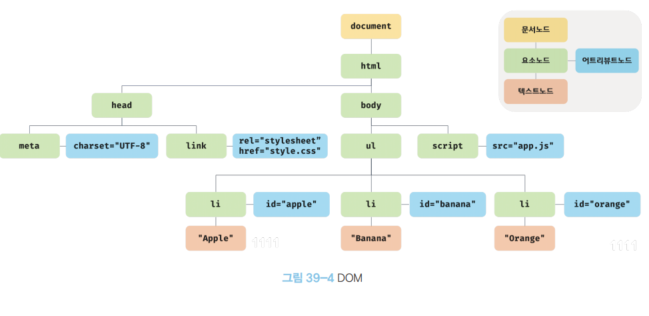
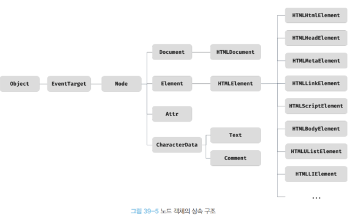
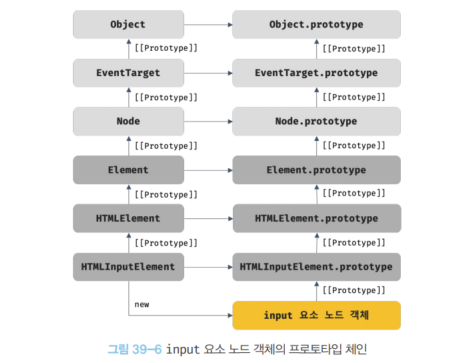
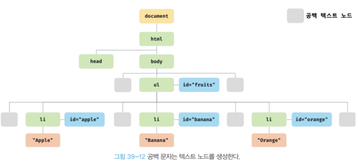

# [39장] DOM

## DOM 이란?

HTML 문서의 계층적 구조와 정보를 표현, 제어할 수 있는 API 를 말한다.
이 API 들은 프로퍼티와 메서드를 제공하며 자료구조 중 트리의 구조 형태로 이뤄져 있다.

## 39.1 노드

### 📝 HTML 요소와 노드 객체

HTML 요소는 `<body></body>`, `<div>></div>` 와 같은 태그들로 표현하는 것들을 말한다.

이런 HTML 요소들은 렌더링 엔진에 의해 DOM을 구성하는 요소 노드 객체로 변환 된다.


이렇게 HTML 요소들을 객체화한 다음, 아래의 트리 구조처럼 구성한다.


### 📝 노드 객체의 타입



위 처럼 DOM 객체가 만들어졌다고 해보자.

HTML 문서의 공백 문자 또한 `공백 텍스트 노드`로 표현되지만, 여기서는 생략했다.

크게 4가지만 보자.

- 문서 노드(document node)

최상위에 존재하는 루트 노드로서 document 객체를 가리킨다.
브라우저가 렌더링한 HTML 문서 전체를 포함하는 객체로, 전역 객체 window 의 document 프로퍼티가 이것이다.

- 요소 노드(element node)

`<a></a>`, `<div></div>` 와 같은 HTML 태그로 표현하는 요소들을 생각하면 된다.

- 어트리뷰트 노드(attribute node)

HTML 요소들의 어트리뷰트를 가리키는 객체다.
별도의 부모 노드를 갖지 않고, 어트리뷰트 노드와 요소 노드 끼리 연결되어 있다.
어트리뷰트 노드를 참조, 변경하려면 요소 노드에 먼저 접근해야 가능하다!

- 텍스트 노드(text node)

HTML 요소 내부에 작성한 텍스트를 가리키는 객체다.
`<div>텍스트 노드에 포함되는 부분</div>`, 이 텍스트 노드는 `<div>` 요소 노드의 자식 노드가 된다.

DOM 에서 leaf node 가 이 텍스트 노드다!

이외에도 총 12 개의 노드 타입이 존재하지만, 나중에 살펴보자.

### 📝 노드 객체의 상속 구조

DOM 에 대해서 간단히 알아보았다.
트리 구조를 통해 HTML 문서의 정보를 표현하고, 문서에 접근 / 제어 할 수 있는 API 를 제공하는 역할을 한다.

이번엔 DOM 을 구성하는 노드 하나가 어떻게 이루어져 있는지 살펴보자.

노드 객체는 ECMAScript 표준 빌트인 객체가 아니고, 브라우저 환경에서 제공하는 호스트 객체다.
하지만, 이들도 프로토타입에 의한 상속 구조를 가지고 있다.



이 구조는 모든 노드 객체가 상속 받는 구조다.
객체이기 때문에, Object 인터페이스를 상속 받은 뒤 차례로 하위 프로토타입을 상속 받는다.

또한, 각 노드의 유형(요소, 어트리뷰트, 텍스트 등)에 따라 추가로 인터페이스를 상속 받는다.

input 요소의 프로토타입 체인을 한 번 살펴보면서 눈으로 익혀보자.



input 요소 하나에 이렇게 많은 객체의 상속이 이루어져있다.

```html
<!DOCTYPE html>
<html lang="en">
  <head>
    <meta charset="UTF-8" />
    <meta name="viewport" content="width=device-width, initial-scale=1.0" />
    <title>Document</title>
  </head>
  <body>
    <input type="text" />
    <script>
      const $input = document.querySelector("input");

      console.log(
        Object.getPrototypeOf($input) === HTMLInputElement.prototype, // true
        Object.getPrototypeOf(HTMLInputElement.prototype) ===
          HTMLElement.prototype, // true
        Object.getPrototypeOf(HTMLElement.prototype) === Element.prototype, // ture
        Object.getPrototypeOf(Element.prototype) === Node.prototype, // true
        Object.getPrototypeOf(EventTarget.prototype) === Object.prototype // true
      );
    </script>
  </body>
</html>
```

위 예시는, 제일 먼저 `input` 요소의 프로토타입을 확인하면서 상위로 올라가고 전체 프로토타입 체인을 확인해보는 예시다.

각 프로토타입 객체가 어떤 기능을 하는지 간단히 알아보자.

| input 요소 노드 객체의 특성                                              | 프로토타입을 제공하는 객체 |
| ------------------------------------------------------------------------ | -------------------------- |
| 객체                                                                     | Object                     |
| 이벤트를 발생시키는 객체                                                 | EventTarget                |
| 트리 자료구조의 노드 객체                                                | Node                       |
| 브라우저가 렌더링할 수 있는 웹 문서 요소(HTML, XML, SVG)를 표현하는 객체 | Element                    |
| 웹 문서 요소 중에서 HTML 요소를 표현하는 객체                            | HTMLElement                |
| HTML 요소 중에서 input 요소를 표현하는 객체                              | HTMLInputElement           |

지금까지 input 요소를 살펴보면서 HTML 문서를 구성하는 요소가 어떻게 구성되어있는지 살펴보았다.

이렇게 다양한 객체들이 존재하기에 우리는 HTML 웹 문서를 동적으로 조작할 수 있게 되는 것이다!

## 39.2 요소 노드 취득

DOM Tree 가 어떻게 이루어져 있는지 알아보았다.

이제는 직접 노드에 접근하는 방법을 알아보자!

### 📝 id 를 이용한 요소 노드 취득

`Document.prototype.getElementById` 메서드를 통해 요소의 id 어트리뷰트 값을 갖는 요소 노드를 탐색해 반환해준다.

```html
<!DOCTYPE html>
<html lang="en">
  <head>
    <meta charset="UTF-8" />
    <meta name="viewport" content="width=device-width, initial-scale=1.0" />
    <title>Document</title>
  </head>
  <body>
    <ul>
      <li id="apple">Apple</li>
      <li id="banana">Banana</li>
      <li id="orange">Orange</li>
    </ul>

    <script>
      // Id 어트리뷰트 값이 banana 인 노드를 탐색해 반환한다.
      const $elem = document.getElementById("banana");

      // $elem 에 저장된 노드의 style.color 프로퍼티 값을 변경한다.
      $elem.style.color = "red";
    </script>
  </body>
</html>
```

`id` 값은 일반적으로 document 내에서 단 하나만 존재해야한다.
다만, 여러 개 사용한다고 해도 오류가 발생하지는 않는다.

만약 동일한 id 값이 여러 개가 있는 경우, `getElementById` 메서드가 반환하는 노드는 HTML 문서의 순서상 첫 번째에 있는 노드가 반환된다.

해당 id 값을 가진 요소 노드가 없는 경우, `null` 을 반환한다.

📗 참고

```html
<!DOCTYPE html>
<html lang="en">
  <body>
    <div id="foo"></div>

    <script>
      // id 값으로 전역 변수가 선언이 되는 것을 볼 수 있다!
      console.log(foo === document.getElementById("foo"));
    </script>
  </body>
</html>
```

### 📝 태그 이름을 이용한 요소 노드 취득

`getElementsByTagName` 메서드를 통해서 html 태그 이름으로 요소를 탐색할 수 있다.

이 메서드는 태그 이름이 일치하는 모든 노드를 반환한다.

```html
<!DOCTYPE html>
<html lang="en">
  <body>
    <ul>
      <li id="apple">Apple</li>
      <li id="banana">Banana</li>
      <li id="orange">Orange</li>
    </ul>

    <script>
      // li 태그 요소들을 모두 반환해준다.
      // 이때, HTMLCollection 객체에 담겨 반환된다.
      const $elem = document.getElementsByTagName("li");
    </script>
  </body>
</html>
```

모든 노드는 HTMLCollection 객체에 담긴다.
이 객체는 유사 배열 객체이면서 이터러블이다!

만약, 특정 요소의 자식 요소에서만 탐색하고 싶다면 이렇게 가능하다.

```html
<!DOCTYPE html>
<html lang="en">
  <body>
    <ul id="fruits">
      <li id="apple">Apple</li>
      <li id="banana">Banana</li>
      <li id="orange">Orange</li>
    </ul>

    <script>
      // li 태그 요소들을 모두 반환해준다.
      // 이때, HTMLCollection 객체에 담겨 반환된다.
      const $fruit = document.getElementById("fruits");

      // ul 하위에 있는 모든 자식 노드에 접근할 수 있다.
      const $listFromFruits = $fruits.getElementByTagName("li");
    </script>
  </body>
</html>
```

### 📝 class 요소를 이용한 요소 노드 취득

`getElementsByClassName` 메서드는 인수로 전달한 class 어트리뷰트 값을 갖는 모든 노드를 반환한다.
이때, class 이름은 공백으로 구분해서 여러 개를 전달할 수 있다.

이 메서드 또한 노드를 HTMLCollection 객체로 반환한다.

```html
<!DOCTYPE html>
<html lang="en">
  <body>
    <ul id="fruits">
      <li id="apple" class="fruit">Apple</li>
      <li id="banana" class="fruit">Banana</li>
      <li id="orange" class="fruit">Orange</li>
    </ul>

    <script>
      // fruit 클래스를 가진 요소들을 모두 반환해준다.
      // 이때, HTMLCollection 객체에 담아 반환한다.
      const $elems = document.getElementsByClassName("fruit");

      [...$elems].forEach((elem) => {
        elem.style.color = "red";
      });
    </script>
  </body>
</html>
```

### 📝 CSS 선택자를 이용한 요소 노드 취득

CSS Selector 는 HTML 요소에 스타일을 적용하고자 할 떄 사용할 수 있다.

```css
/* 전체 선택자: 모든 요소를 선택 */
* {
  ...;
}

/* 태그 선택자: 모든 p 태그 요소를 모두 선택 */
p {
  ...;
}

/* id 선택자: id 값이 'foo'인 요소를 모두 선택 */
#foo {
  ...;
}

/* class 선택자: class 값이 'foo' 인 요소를 모두 선택 */
.foo {
  ...;
}

/* 어트리뷰트 선택자: input 요소 중에 type 어트리뷰트 값이 'text'인 요소 모두 선택 */
input[type="text"] {
  ...;
}

/* 후손 선택자: div 요소의 자식 요소 중 p 요소를 모두 선택 */
div p {
  ...;
}

/* 자식 선택자: div 요소의 자식 요소 중 p 요소를 모두 선택 */
div > p {
  ...;
}

/* 인접 형제 선택자: p 요소의 형제 요소 중에 p 요소 바로 뒤에 위치하는 ul 요소 선택 */
p + ul {
  ...;
}

/* 일반 형제 선택자: p 요소의 형제 요소 중에 p 요소 뒤에 위치하는 ul 요소 모두 선택 */
p ~ ul {
  ...;
}

/* 가상 클래스 선태갖: hover 상태인 a 요소를 모두 선택 */
a:hover {
  ...;
}

/* 가상 요소 선택자: p 요소의 콘텐츠의 앞에 위치하는 공간을 선택 */
/* 일반적으로 content 프로퍼티와 함께 사용됨 */
p::before {
  ...;
}
```

`querySelector` 메서드는 이런 CSS 선택자를 지원한다.

```html
<!DOCTYPE html>
<html lang="en">
  <body>
    <ul id="fruits">
      <li id="apple" class="fruit">Apple</li>
      <li id="banana" class="fruit">Banana</li>
      <li id="orange" class="fruit">Orange</li>
    </ul>

    <script>
      // id 값이 banana 인 요소를 하나 반환해준다.
      const $elem = document.querySelector("#banana");

      // class 값이 fruit 인 요소를 모두 반환해준다
      const $elem = document.querySelectorAll(".fruit");

      [...$elems].forEach((elem) => {
        elem.style.color = "red";
      });
    </script>
  </body>
</html>
```

`querySelectorAll` 메서드는 NodeList 라는 유사 배열 객체이면서 이터러블 객체를 반환한다.

### 📝 특정 요소 노드를 취득할 수 있는지 확인

`mathces` 메서드를 통해 특정 요소 노드를 취득할 수 있는지 확인할 수 있다.

```html
<!DOCTYPE html>
<html lang="en">
  <body>
    <ul id="fruits">
      <li id="apple" class="fruit">Apple</li>
      <li id="banana" class="fruit">Banana</li>
      <li id="orange" class="fruit">Orange</li>
    </ul>

    <script>
      const $apple = document.querySelector("#banana");

      // $apple 노드의 자식 노드 중 li 면서 클래스가 apple 인 것이 있는지.
      console.log($apple.matches("#fruits > li.apple")); // true

      console.log($apple.matches("#fruits > li.ice")); // false
    </script>
  </body>
</html>
```

위 방법은 이벤트 위임을 사용할 때 유용하다!

### 📝 HTMLCollection 과 NodeList

앞서, 메서드에 따라 HTMLCollection 을 반환하기도 하고, NodeList 를 반환하기도 했다.

둘은 모두 유사 배열 객체이면서 이터러블라는 공통점이 있어, for ... of 문으로 순회가 가능하다.
또한 스프레드 연산자를 사용해 간단히 배열로 변환도 가능하다.

📗 HTMLCollection

HTMLCollection 객체는 노드 객체의 상태 변화를 실시간으로 반영한다.

📗 NodeList

NodeList 객체는 이와 달리 실시간으로 노드 객체의 상태 변경을 반영하지 않는다.

### 39.3 노드 탐색

```html
<ul id="fruits">
  <li id="apple" class="fruit">Apple</li>
  <li id="banana" class="fruit">Banana</li>
  <li id="orange" class="fruit">Orange</li>
</ul>
```

이렇게 구조를 갖추고 있을 때,
각 노드에서 아래와 같은 프로퍼티를 참조하면 부모 노드나 자식 노드 또는 형제 자매 노드에 접근할 수 있다.

1. parentNode: 부모 노드
2. previousSibling: 형제 / 자매 노드
3. firstChild: 첫 번째 자식 노드
4. childNodes / children: 바로 아래에 있는 모든 자식 노드들

### 📝 공백 텍스트 노드

HTML 문서를 작성했을 때 사용한 모든 공백문자는 개별 텍스트 노드를 생성한다.

```html
<ul id="fruits">
  <li id="apple" class="fruit">Apple</li>
  <li id="banana" class="fruit">Banana</li>
  <li id="orange" class="fruit">Orange</li>
</ul>
```

이런 문서의 경우, 아래와 같은 텍스트 노드들이 생성된다.



### 📝 자식 노드 탐색

| 프로퍼티                   | 설명                                                                                                   |
| -------------------------- | ------------------------------------------------------------------------------------------------------ |
| Node.prototype.childNodes  | 자식 노드를 모두 탐색해 NodeList 객체에 담아 반환, 이때 텍스트 노드도 포함될 수 있음                   |
| Element.prototype.children | 자식 노드 중 요소 노드만 모두 탐색해 HTMLCollection 객체에 담아 반환, 이때 텍스트 노드는 포함되지 않음 |

| 프로퍼티                            | 설명                                                          |
| ----------------------------------- | ------------------------------------------------------------- |
| Node.prototype.firstChild           | 첫 번째 자식 노드 반환, 이 노드는 텍스트 노드거나 요소 노드   |
| Node.prototype.lastChild            | 마지막 자식 노드 반환, 이 노드 역시 텍스트 노드거나 요소 노드 |
| Element.prototype.firstElementChild | 첫 번째 자식 요소 노드 반환, 이 노드는 요소 노드임            |
| Element.prototype.lastElementChild  | 마지막 자깃 요소 노드 반환, 이 노드 역시 요소 노드            |

```html
<!DOCTYPE html>
<html lang="en">
  <body>
    <ul id="fruits">
      <li id="apple" class="fruit">Apple</li>
      <li id="banana" class="fruit">Banana</li>
      <li id="orange" class="fruit">Orange</li>
    </ul>

    <script>
      const $fruits = document.querySelector("#fruits");

      console.log($fruits.childNodes);
      // NodeList(7) [text, li.apple, text, li.banana, text, li.orange, text]

      console.log($fruits.children);
      // NodeList(7) [li.apple, li.banana, li.orange]

      console.log($fruits.firstChild); // #text
      // 첫 번째 자식 노드 반환, firstChild 는 텍스트 노드도 반환 가능

      console.log($fruits.lastChild); // #text
      // 마지막 자식 노드 반환, firstChild 는 텍스트 노드도 반환 가능

      console.log($fruits.firstElementChild); // li.apple
      // 첫 번째 자식 요소 노드 반환

      console.log($fruits.lastElemntChild); // li.orange
      // 마지막 자식 요소 노드 반환
    </script>
  </body>
</html>
```

### 📝 자식 노드 존재 확인

`hasChildNodes` 메서드를 통해 자식 노드의 존재를 boolean 값을 통해 알 수 있다.

```html
<!DOCTYPE html>
<html lang="en">
  <body>
    <ul id="fruits"></ul>

    <script>
      const $fruits = document.querySelector("#fruits");

      console.log($fruits.hasChildNodes());
      // 이 상태에서 텍스트 노드가 존재한다면 true, 그렇지 않다면 false
    </script>
  </body>
</html>
```

### 📝 요소 노드의 텍스트 노드 탐색

요소 노드의 텍스트 노드는 firstChild 프로퍼티로 접근할 수 있다.
firstChild 프로퍼티는 첫 번째 자식 노드를 반환하는데, 이 경우 반환하는 노드는 텍스트 노드거나 요소 노드가 된다.

### 📝 부모 노드 탐색

parentNode 프로퍼티를 통해 접근할 수 있다.

### 📝 형제 노드 탐색

| 프로퍼티                                 | 설명                                                                                                    |
| ---------------------------------------- | ------------------------------------------------------------------------------------------------------- |
| Node.prototype.previousSibling           | 부모 노드가 같은 형제 노드 중 이전 형제 노드를 탐색해 반환, 요소 노드 뿐만 아니라 텍스트 노드일 수 있음 |
| Node.prototype.nextSibling               | 부모 노드가 같은 형제 노드 중 다음 형제 노드를 탐색해 반환, 요소 노드 뿐만 아니라 텍스트 노드일 수 있음 |
| Element.prototype.previousElementSibling | previousSibling 과 유사하지만, 이 메서드는 요소 노드만 반환                                             |
| Element.prototype.nextElementSibling     | nextSibling 과 유사하지만, 요소 노드만 반환                                                             |

### 39.4 노드 정보 취득

| 프로퍼티                | 설명                                                                                                                      |
| ----------------------- | ------------------------------------------------------------------------------------------------------------------------- |
| Node.prototype.nodeType | 노드 유형을 나타내는 상수를 반환, 1 일 경우 요소 노드, 3일 경우 텍스트 노드, 9일 경우 문서 노드 타입                      |
| Node.prototype.nodeName | 노드 이름을 문자열로 반환, 요소 노드는 문자열("UL", "LI"), 텍스트 노드는 "#text" 를 반환, 문서 노드는 "#document" 를 반환 |

### 39.5 요소 노드의 텍스트 조작

📗 nodeValue

`nodeValue` 프로퍼티를 참조하면 노드 객체의 값을 반환해준다.
이 값은 텍스트 노드의 값으로, 텍스트 노드가 아닌 노드의 `nodeValue` 를 참조하면 null 을 반환한다.

`nodeValue` 프로퍼티에 값을 할당하면, 텍스트를 변경할 수 있다.
다만 요소 노드의 자식 노드로 텍스트 노드가 존재하는지 확인할 필요가 있다.

```html
<!DOCTYPE html>
<html lang="en">
  <body>
    <div id="foo">Hello</div>
  </body>
  <script>
    // #foo 의 자식 노드인 텍스트 노드를 참조
    const $textNode = document.getElementById("foo").firstChild;

    $textNode.nodeValue = "World";

    console.log($textNode.nodeValue); // World
  </script>
</html>
```

📗 textContent

요소 노드의 텍스트와 모든 자손 노드의 텍스트를 모두 참조할 수 있고, 조작할 수 있다.

`nodeValue` 를 사용하는 것 보다, `textContent` 를 통해 접근하는 것이 편리하다.

```html
<!DOCTYPE html>
<html lang="en">
  <body>
    <div id="foo">Hello</div>
  </body>
  <script>
    // #foo 의 자식 노드인 텍스트 노드를 참조
    const $textNode = (document.getElementById("foo").textContent =
      "Hi <span>there</span>");
  </script>
</html>
```

textContent 는 텍스트 노드를 따로 찾을 필요가 없이, 요소 노드의 텍스트 값을 바로 반환하기에 편리한 것이다.
이와 유사한 동작으로 innerText 가 있지만, 이 프로퍼티는 CSS 에 의해 영향을 받기에 사용하지 않는 것이 좋다.

예를 들어, innerText 프로퍼티의 경우 CSS 속성 중 visibility: hidden 으로 지정된 요소 노드의 경우 텍스트를 반환하지 않기에 문제가 된다.

### 39.6 DOM 조작

DOM 을 조작하는 것은 새로운 노드를 생성해 DOM 에 추가하거나 기존 노드를 수정 / 삭제하는 것을 말한다.

DOM 조작에 의해 새로운 노드가 추가되거나 삭제되면 리플로우, 리페인트가 발생해 성능 저하의 원인이 될 수 있으니 주의해야한다.

### 📝 innerHTML

innertHTML 프로퍼티는 요소 노드의 HTML 마크업을 수정할 수 있게 해준다.
아래 예시를 보자.

```html
<!DOCTYPE html>
<html lang="en">
  <body>
    <div id="foo">Hello <span>world!</span></div>
  </body>
  <script>
    const $foo = document.querySelector("#foo");
    // #foo 요소의 콘텐츠 영역 내의 HTML 마크업을 전부 문자열로 취득한다.
    console.log($foo.innerHTML);
    // "Hello <span>world!</span>"

    $foo.innerHTML = "<p class="orange">Orange</p>";
    // <div id="foo">Hello <p class="orange">Orange/p></div>

    $foo.innerHTML = "";
    // <div id="foo"></div>
  </script>
</html>
```

이렇게 `innerHTML` 은 마크업 문자까지 변경이 가능하다.
하지만, 이를 통해 `<script></script>` 태그를 삽입해 코드를 실행하게 만들 수 있기에 위험하다.

HTML5 부터는 `script` 태그의 동작을 무시하지만 이를 우회할 수 있다.

```html
<!DOCTYPE html>
<html lang="en">
  <body>
    <div id="foo">Hello <span>world!</span></div>
  </body>
  <script>
    const $foo = document.querySelector("#foo");

    $foo.innerHTML = "";
  </script>
</html>
```

이렇게 오류를 일으켜 코드가 실행되게 만들 수 있다.

📚 HTML 새니티재이션(HTML sanitization)

위와 같은 크로스 사이트 스크립팅 공격을 예방하기 위해 잠재적 위협을 제거하는 것을 말한다.
이는 DOMPurify 라이브러리를 통해 쉽게 구현할 수 있다.

### 📝 insertAdjacentHTML

`insertAdjacentHTML` 메서드는 기존 요소를 제거하지 않으면서, 새로운 요소를 삽입할 때 위치또한 지정할 수 있다.

사용법은 아래와 같다.

```html
<!DOCTYPE html>
<html lang="en">
  <body>
    <!-- beforebegin -->
    <div id="foo">
      <!-- afterbegin -->
      Hello
      <!-- beforeend -->
      <span>world!</span>
    </div>
    <!-- afterend -->
  </body>
  <script>
    const $foo = document.querySelector("#foo");

    $foo.insertAdjacentHTML("beforebegin", "<p>beforebegin</p>");
    $foo.insertAdjacentHTML("afterbegin", "<p>afterbegin</p>");
    $foo.insertAdjacentHTML("beforeend", "<p>beforeend</p>");
    $foo.insertAdjacentHTML("afterend", "<p>afterend</p>");
  </script>
</html>
```

이런 방법은 기존 요소에는 영향을 주지 않으면서 새로 추가할 요소만을 파싱해 자식 요소로 추가하기에 innerHTML 프로퍼티 보다 효율적이다.

다만, 마찬가지로 HTML 마크업 문자열을 파싱하기에 크로스 사이트 스크립팅 공격에 취약하다.

### 📝 노드 생성과 추가

지금까지 노드를 생성하거나 추가하는 방법 2가지 (innerHTML, insertAdjacentHTML)를 알아보았다.

이외에도 다양한 API 를 알아보자.

```html
<!DOCTYPE html>
<html lang="en">
  <body>
    <div id="fruits">
      <li>Apple</li>
    </div>
  </body>
  <script>
    const $fruits = document.getElementById("fruits");

    // 요소 노드 생성
    const $li = document.createElement("li");

    // 텍스트 노드 생성
    const textNode = document.createTextNode("Banana");

    // 텍스트 노드를 $li 요소 노드의 자식 노드로 추가
    $li.appendChild(textNode);

    // $li 요소 노드를 #fruits 요소 노드의 마지막 자식 노드로 추가
    $fruits.appendChild($li);
  </script>
</html>
```

### 📝 복수의 노드 생성과 추가

이번 예시는 여러 개의 요소 노드를 생성하고 추가해보자.

```html
<!DOCTYPE html>
<html lang="en">
  <body>
    <div id="fruits"></div>
  </body>
  <script>
    const $fruits = document.getElementById("fruits");

    ["Apple", "Banana", "Orange"].forEach(text => {
      // 요소 노드 생성
      const $li = document.createElement("li");

      // 텍스트 노드 생성
      const textNode = document.createTextNode(text);

      // 텍스트 노드를 $li 요소 노드의 자식 노드로 추가
      $li.appendChild(textNode);

      // $li 요소 노드를 #fruits 요소 노드의 마지막 자식 노드로 추가
      $fruits.appendChild($li);
    };
    })
  </script>
</html>
```

하지만, 이런 방법은 DOM 요소를 3번 추가하는 동작을 하기에 높은 비용이 든다.
DOM 을 변경하는 작업 자체가 리플로우와 리페인트라는 높은 비용이 들기 때문이다.

이를 해결하는 방법은 `DocumentFragment` 노드를 통해 해결할 수 있다.
이 노드 또한 노드 객체의 일종인데, 별도의 부모 노드가 없어 기존 DOM 과는 분리되어 있다.

이를 통해 별도의 DOM 을 구성한 다음, 기존의 DOM 에 한 번에 추가하는 용도로 사용할 수 있다.

```html
<!DOCTYPE html>
<html lang="en">
  <body>
    <div id="fruits"></div>
  </body>
  <script>
    const $fruits = document.getElementById("fruits");

    // DocumentFragment 노드 생성
    const $fragment = document.createDocumentFragment();

    ["Apple", "Banana", "Orange"].forEach(text => {
      // 요소 노드 생성
      const $li = document.createElement("li");

      // 텍스트 노드 생성
      const textNode = document.createTextNode(text);

      // 텍스트 노드를 $li 요소 노드의 자식 노드로 추가
      $li.appendChild(textNode);

      // $li 요소 노드를 #fruits 요소 노드의 마지막 자식 노드로 추가
      $fragment.appendChild($li);
    };

    // DocumentFragment 노드를 $fruits 요소의 마지막 자식 노드로 추가
    $fruits.appendChild($fragment);
    })
  </script>
</html>
```

이렇게 하면, 리플로우와 리페인트가 한 번만 일어나서 보다 효율적이다.

### 📝 노드 삽입

📗 마지막 노드로 추가

`appendChild` 메서드는 전달 받은 노드를 항상 마지막 자식 노드로 추가한다.

📗 지정한 위치에 노드 삽입

`insertBefore` 메서드는 첫 번째 인수로 전달받은 노드를 두 번째 인수로 전달 받은 노드 앞에 삽입한다.

두 번째 인수에 null 을 전달하면, `appendChild` 와 동일하게 동작한다.

### 📝 노드 이동

이미 존재하는 노드를 `appendChild` 나 `insertBefore` 메서드로 DOM 에 다시 추가하려고 하면, 위치를 이동하는 효과를 낼 수 있다.

### 📝 노드 복사

`cloneNode` 메서드는 노드의 사본을 생성해 반환한다. 깊은 복사 / 얕은 복사를 선택할 수 있다.

```javascript
const $elem = document.createElement("li");

const $shallowClone = $elem.cloneNode();

const $deepClone = $elem.cloneNode(true);
```

### 📝 노드 교체

`replaceChild` 메서드는 자신을 호출한 노드의 자식 노드를 교체할 수 있다.
첫 번째 매개변수에는 새로운 노드를 전달하고, 두 번째 매개변수에 교체 대상 노드를 전달하면 된다.

이때, 기존 노드는 아예 삭제하고 새로운 노드를 추가하는 방식이다.

### 📝 노드 삭제

`removeChild` 메서드는 호출한 노드의 자식 노드를 삭제한다.

## 39.7 어트리뷰트

### 📝 어트리뷰트 노드와 atrributes 프로퍼티

HTML 요소는 여러 개의 attribute 를 가질 수 있다.

요소의 atrribute 는 아래 처럼 정의할 수 있다.

```html
<input id="user" type="text" value="ungmo2" />
```

이렇게 input 노드에 3개의 어트리뷰트를 정의하게 되면, 3개의 노드가 생성된다.

이 노드들은 NamedNodeMap 객체에 담겨 요소 노드의 attributes 프로퍼티에 저장된다.

### 📝 HTML 어트리뷰트 조작

attributes 프로퍼티에 접근해 값을 얻을 수 있지만, 변경은 불가능하다.
이 때, `getAttribute`, `setAttribute` 메서드를 통해 값 참조 / 변경이 가능하다.

또한, 특정 어트리뷰트를 가지고 있는지 확인하려면 `hasAttribute` 메서드가 있으며 삭제하고 싶다면 `removeAttribute` 메서드를 사용하면 된다.

### 📝 HTML 어트리뷰트 vs DOM 프로퍼티

요소 노드 객체에서는 HTML 어트리뷰트 값을 NamedNodeMap 객체에 담아 저장한다고 했다.

그런데, 노드의 atrributes 프로퍼티에서 어트리뷰트 노드가 존재하고 프로퍼티로도 접근이 가능하다.

그렇다면, 2가지로 접근이 가능한데 HTML 어트리뷰트와 DOM 프로퍼티가 중복된 역할을 하는 것일까?

그 보다는 HTML 어트리뷰트 는 HTML 요소의 초기 상태를 지정하는 것에 사용한 뒤, 이후는 DOM 프로퍼티에서 관리하게 된다.

요소 노드는 상태를 갖고 있는데, 사용자의 입력 값을 받아 이용할 수 있는 것도 이 덕분이다.

이때, 초기 상태는 어트리뷰트 노드가 관리하고 있으며, 변하는 값은 DOM 프로퍼티가 관리하게 되는 것이다.

📗 어트리뷰트 노드

HTML 어트리뷰트 노드로 지정한 HTML 요소의 초기 상태는 어트리뷰트 노드에서 관리한다.

어트리뷰트 노드에서 관리하는 어트리뷰트 값은 사용자에 입력에 따라 변화하는 값이 아니다.
초기 상태를 저장하는 역할로, 이 상태를 참조 / 변경하고 싶다면 `getAttribute`, `setAttribute` 메서드를 사용하면 된다.

📗 DOM 프로퍼티

사용자가 입력한 최신 상태는 HTML 어트리뷰트에 대응하는 요소 노드의 DOM 프로퍼티가 관리한다.
DOM 프로퍼티는 사용자의 입력에 의한 상태 변화에 반응해 언제나 최신 상태를 반영한다.

DOM 프로퍼티로 취득한 값은 HTML 요소의 최신 상태 값을 의미한다.
앞서 다룬 어트리뷰트 노드 값의 경우 DOM 프로퍼티가 변하더라도 초기 상태를 유지한다.

### 📝 data 어트리뷰트와 dataset 프로퍼티

data 어트리뷰트와 dataset 프로퍼티를 사용하면 HTML 요소에 정의한 사용자 정의 어트리뷰트와 자바스크립트 간에 데이터를 교환 가능하다!

data 어트리뷰트는 data-user-id, data-role 과 같이 data- 접두사를 사용하고 임의의 이름을 붙이면 된다.

```html
<!DOCTYPE html>
<html lang="en">
  <body>
    <ul class="users">
      <li id="1" data-user-id="7621" data-role="admin">Lee</li>
      <li id="2" data-user-id="9524" data-role="subscriber">Kim</li>
    </ul>
  </body>
</html>
```

data 어트리뷰트의 값은 HTMLElement.dataset 프로퍼티로 취득할 수 있다.
dataset 프로퍼티는 HTML 요소의 모든 data 어트리뷰트의 정보를 제공하는 DOMStringMap 객체를 반환한다.
DOMStringMap 객체가 가진 프로퍼티 중 data 어트리뷰트의 data- 접두사 이후에 붙인 이름을 카멜케이스로 변환한 이름이 존재한다. 이 프로퍼티로 data 어트리뷰트의 값을 취득하거나 변경할 수 있다.

```html
<!DOCTYPE html>
<html lang="en">
  <body>
    <ul class="users">
      <li id="1" data-user-id="7621" data-role="admin">Lee</li>
      <li id="2" data-user-id="9524" data-role="subscriber">Kim</li>
    </ul>
    <script>
      const users = [...document.querySelector(".users").children];

      // user-id "7621" 인 요소 노도를 취득, 프로퍼티 값이 카멜케이스로 되어있다.
      const user = users.find((user) => user.dataset.userId === "7621");
      // user-id 가 "7621" 인 요소 노드에서 data-role 의 값을 취득
      console.log(user.dataset.role); // "admin"

      // user-id 가 "7621" 인 요소 노드의 data-role 값을 변경
      user.dataset.role = "subscriber";

      // dataset 프로퍼티는 DOMStringMap 객체를 반환
      console.log(user.dataset); // DOMStringMap {userId: "7621", role: "subscriber"}
    </script>
  </body>
</html>
```

## 39.8 스타일

### 📝 인라인 스타일 조작

```html
<!DOCTYPE html>
<html lang="en">
  <body>
    <div style="color: red">Hello World</div>
    <script>
      const $div = document.querySelector("div");

      // 인라인 스타일 취득
      console.log($div.style);

      // 인라인 스타일 변경
      $div.style.color = "blue";

      // 인라인 스타일 추가
      $div.style.width = "100px";
      $div.style.height = "100px";
      $div.style.backgroundColor = "yellow";
    </script>
  </body>
</html>
```

### 📝 클래스 조작

HTML 요소의 class 어트리뷰트에 대응하는 요소 노드의 DOM 프로퍼티에 접근해 조작이 class 조작이 가능하다.

📗 className
`className` 프로퍼티를 참조하면 class 어트리뷰트 값을 문자열로 반환하고, 요소 노드의 className 프로퍼티에 문자열을 할당하면 class 어트리뷰트 값을 할당한 문자열로 변경한다.

```html
<!DOCTYPE html>
<html lang="en">
  <style>
    .box {
      width: 100px;
      height: 100px;
    }
    .red {
      color: red;
    }
    .blue {
      color: blue;
    }
  </style>
  <body>
    <div class="box red">Hello World</div>
    <script>
      const $box = document.querySelector(".box");

      // .box 요소의 class 어트리뷰트 값을 취득
      console.log($box.className); // 'box red'

      // .box 요소의 class 어트리뷰트 값 중에서 'red' 만 'blue' 로 변경
      $box.className = $box.className.replace("red", "blue");
    </script>
  </body>
</html>
```

하지만, className 프로퍼티는 문자열로 반환하기 때문에, 여러 개의 클래스를 다루기엔 불편함이 있다.

📗 classList

classList 프로퍼티는 class 어트리뷰트의 정보를 담은 DOMTokenList 객체를 반환

```html
<!DOCTYPE html>
<html lang="en">
  <style>
    .box {
      width: 100px;
      height: 100px;
    }
    .red {
      color: red;
    }
    .blue {
      color: blue;
    }
  </style>
  <body>
    <div class="box red">Hello World</div>
    <script>
      const $box = document.querySelector(".box");

      // .box 요소의 class 어트리뷰트 값을 취득
      console.log($box.classList); // 'box red'
      // DOMTokenList(2) [length: 2, value: "box blue", 0: "box", 1: "blue"]

      // .box 요소의 class 어트리뷰트 값 중에서 'red' 만 'blue' 로 변경
      $box.classList.replace("red", "blue");
    </script>
  </body>
</html>
```

DOMTokenList 객체는 유용한 메서드를 제공하고 있어 편리하다.

- add(...className)

```javascript
$box.classList.add("foo"); // class="box red foo"
$box.classList.add("bar", "baz"); // class="box red foo bar baz"
```

add 메서드는 인수로 전달한 문자열을 class 어트리뷰트 값으로 추가한다.

- remove(...className)

```javascript
$box.classList.remove("foo"); // class="box red bar baz"
$box.classList.remove("bar", "baz"); // class="box red"
$box.classList.remove("x"); // class="box red"
```

remove 메서드는 인수로 전달한 문자열을 class 어트리뷰트 값에서 제거한다.
존재하지 않는 class 명을 전달하면 암묵적으로 무시된다.

- item(index)

```javascript
$box.classList.item(0); // -> "box"
$box.classList.item(1); // -> "red"
```

해당 index 에 해당하는 class 어트리뷰트에서 반환한다.

- contains(className)

```javascript
$box.classList.contains("box"); // -> true
$box.classList.contains("blue"); // -> false
```

contains 메서드는 인수로 전달한 문자열과 일치하는 클래스가 class 어트리뷰트에 포함되어 있는지 확인한다.

- replace(old, new)

```javascript
$box.classList.replace("red", "blue"); // class="box blue"
```

- toggle(className[. force])

```javascript
$box.classList.toggle("foo"); // class="box blue foo"
$box.classList.toggle("foo"); // class="box blue"
```

### 📝 요소에 적용되어 있는 CSS 스타일 참조

style 프로퍼티는 인라인 스타일만 반환한다.
따라서, 클래스를 적용하거나 상속을 통해 암묵적으로 적용한 스타일의 경우에는 참조할 수 없다.
이때, 모든 CSS 스타일을 참조할 경우 `getComputedStyle` 메서드를 사용한다.
