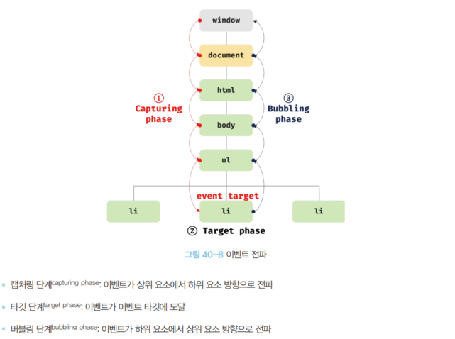

# [40장] 이벤트

## 40.1 이벤트 드리븐 프로그래밍

브라우저는 마우스 클릭, 키보드 입력, 마우스 이동 등이 일어나면 감지해 특정한 타입의 이벤트를 발생시킨다.

이런 이벤트가 발생했을 때, 별도로 함수를 호출해 동작을 정의할 수 있다.
이 함수를 이벤트 핸들러(Event Handler)라고 부르고, 이벤트 핸들러의 호출을 위임하는 것을 **이벤트 핸들러 등록**이라 부른다.

브라우저가 감지하는 이벤트는 어떤 것이 있는지 알아보자.

## 40.2 이벤트 타입

### 📝 마우스 이벤트

| 이벤트     | 이벤트 발생 시점                                             |
| ---------- | ------------------------------------------------------------ |
| click      | 마우스 버튼을 클릭했을 때                                    |
| dbclick    | 마우스 버튼을 더블 클릭했을 때                               |
| mousedown  | 마우스 버튼을 눌렀을 때                                      |
| mouseup    | 누르고 있던 마우스 버튼을 놓았을 때                          |
| mousemove  | 마우스 커서를 움직였을 때                                    |
| mouseenter | 마우스 커서를 HTML 요소 안으로 이동했을 때(버블링 되지 않음) |
| mouseover  | 마우스 커서를 HTML 요소 안으로 이동했을 때(버블링 됨)        |
| mouseleave | 마우스 커서를 HTML 요소 밖으로 이동했을 때(버블링 되지 않음) |
| mouseout   | 마우스 커서를 HTML 요소 밖으로 이동했을 때(버블링 됨)        |

### 📝 키보드 이벤트

| 이벤트 타입 | 이벤트 발생 시점                                                                                                       |
| ----------- | ---------------------------------------------------------------------------------------------------------------------- |
| keydown     | 키보드의 모든 키 입력시 연속적 발생(문자, 숫자, 특문, enter 를 제외한 경우는 한 번만 발생)                             |
| keypress    | 문자 키를 눌렀을 때 연속적으로 발생(deprecated)                                                                        |
| keyup       | 누르고 있던 키를 놓았을 때 한 번만 발생(control, option, shift, tab, delete, enter, 방향키, 문자, 특문 키를 놓았을 때) |

### 📝 포커스 이벤트

| 이벤트 타입 | 이벤트 발생 시점                             |
| ----------- | -------------------------------------------- |
| focus       | HTML 요소가 포커스를 받았을 때(버블링 안 됨) |
| blur        | HTML 요소가 포커스를 잃었을 때(버블링 안 됨) |
| focusin     | HTML 요소가 포커스를 받았을 때(버블링 됨)    |
| focusout    | HTML 요소가 포커스를 잃었을 때(버블링 됨)    |

❗focusin, focusout 이벤트는 addEventListener 메서드로 추가해야 크롬과 사파리에서 올바르게 동작한다. 이벤트 핸들러 프로퍼티 방식(onfocusin, onfocusout 등)으로 추가하면 동작하지 않는다.

### 📝 폼 이벤트

| 이벤트 타입 | 이벤트 발생 시점                                                                                                                                   |
| ----------- | -------------------------------------------------------------------------------------------------------------------------------------------------- |
| submit      | form 요소 내의 input, select 입력 필드에서 엔터 키를 눌렀을 때 또는 form 요소 내의 submit 버튼(`<button`, `<input type="submit">`>) 을 클릭했을 때 |
| reset       | form 요소 내의 reset 버튼을 클릭했을 때(잘 사용하지 않음)                                                                                          |

### 📝 값 변경 이벤트

| 이벤트 타입      | 이벤트 발생 시점                                                                                                          |
| ---------------- | ------------------------------------------------------------------------------------------------------------------------- |
| input            | input, select, textarea 요소의 값이 입력되었을 때                                                                         |
| change           | input, select, textarea 요소의 값이 변경되었을 때                                                                         |
| readystatechange | HTML 문서의 로드와 파싱 상태를 나타내는 document.readyState 프로퍼티 값('loading', 'interactive', 'complete')이 변경될 때 |

### 📝 DOM 뮤테이션 이벤트

| 이벤트 타입      | 이벤트 발생 시점                                   |
| ---------------- | -------------------------------------------------- |
| DOMContentLoaded | HTML 문서의 로드와 파싱이 완료돼 DOM 생성이 완료시 |

### 📝 뷰 이벤트

| 이벤트 타입 | 이벤트 발생 시점                                                |
| ----------- | --------------------------------------------------------------- |
| resize      | 브라우저 윈도우(window)의 크기를 리사이즈할 때 연속적으로 발생  |
| scroll      | 웹페이지(document) 또는 HTML 요소를 스크롤할 때 연속적으로 발생 |

### 📝 리소스 이벤트

| 이벤트 타입 | 이벤트 발생 시점                                                                   |
| ----------- | ---------------------------------------------------------------------------------- |
| load        | DOMContentLoaded 이벤트 발생 후, 모든 리소스(이미지, 폰트 등)의 로딩이 완료됐을 때 |
| unload      | 리소스가 언로드될 때(주로 새로운 웹 페이지를 요청한 경우)                          |
| abort       | 리소스 로딩이 중단됐을 때                                                          |
| error       | 리소스 로딩이 실패했을 때                                                          |

## 40.3 이벤트 핸들러 등록

이벤트 핸들러 등록 방법에 대해 알아보자.

### 📝 이벤트 핸들러 어트리뷰트 방식

아래와 같이 사용하면 된다.

```html
<!DOCTYPE html>
<html>
  <body>
    <button onclick="sayHi('Lee')">Click me!</button>
    <script>
      function sayHi(name) {
        console.log(`Hi! ${name}. `);
      }
    </script>
  </body>
</html>
```

이렇게 어트리뷰트 값으로 함수 호출문을 할당하는 방식이다.

vanila JS 와 함께 사용하는 경우, 이런 방식은 권장하지 않는다.
그러나 현재 많이 이용하는 컴포넌트 기반 프레임워크 / 라이브러리에서는 이 방식을 다시 사용하게 된다.

### 📝 이벤트 핸들러 프로퍼티 방식

DOM 노드 객체는 이벤트 핸들러에 대한 프로퍼티 또한 가지고 있다.
이 프로퍼티에 함수를 할당하면 이벤트 핸들러 등록이 가능하다.

```html
<!DOCTYPE html>
<html>
  <body>
    <button>Click me!</button>
    <script>
      const $button = document.querySelector("button");

      // 이벤트 핸들러 프로퍼티에 이벤트 핸들러를 바인딩
      $button.onclick = function () {
        console.log("button click 1");
      };

      // 이벤트 핸들러 프로퍼티에 다른 이벤트 핸들러를 재할당, 첫 번째로 등록한 함수는 실행되지 않음
      $button.onclick = function () {
        console.log("button click 2");
      };
    </script>
  </body>
</html>
```

### 📝 addEventListener 메서드 방식

`addEventListener` 메서드를 사용해 이벤트 핸들러를 등록할 수 있다.


첫 번째 매개변수는 이벤트 종류가 온다.
두 번째 매개변수는 이벤트 핸들러를 전달받는다.
마지막 세 번째 매개변수는 생략 가능하며, 이벤트 캡처링 또는 이벤트 버블링을 사용할 것인지 선택할 수 있다. 기본값은 버블링이다.

```html
<!DOCTYPE html>
<html>
  <body>
    <button>Click me!</button>
    <script>
      const $button = document.querySelector("button");

      // 이벤트 핸들러 프로퍼티에 이벤트 핸들러를 바인딩
      $button.onclick = function () {
        console.log("button click 1");
      };

      $button.addEventListener("click", function () {
        console.log("button click 2");
      });
    </script>
  </body>
</html>
```

위 예시를 보면, 이벤트 핸들러 프로퍼티에 바인딩한 이벤트 핸들러와 `addEventListener()` 메서드로 추가한 것 모두 함께 동작한다.

`addEventListener()` 메서드는 하나 이상의 이벤트 핸들러를 등록할 수 있다.

```html
<!DOCTYPE html>
<html>
  <body>
    <button>Click me!</button>
    <script>
      const $button = document.querySelector("button");

      // 이벤트 핸들러 프로퍼티에 이벤트 핸들러를 바인딩
      $button.addEventListener("click", function () {
        console.log("button click 1");
      });
      $button.addEventListener("click", function () {
        console.log("button click 2");
      });
    </script>
  </body>
</html>
```

아래와 같이 동일한 참조를 가진 함수(이벤트 핸들러)를 등록할 경우 하나만 등록이 된다.

```html
<!DOCTYPE html>
<html>
  <body>
    <button>Click me!</button>
    <script>
      const $button = document.querySelector("button");

      const handleClick = function () {
        console.log("button click 1");
      };

      // 이벤트 핸들러 프로퍼티에 이벤트 핸들러를 바인딩
      $button.addEventListener("click", handleClick);
      $button.addEventListener("click", handleClick);
    </script>
  </body>
</html>
```

## 40.4 이벤트 핸들러 제거

`removeEventListener` 메서드를 사용하면 등록된 이벤트 핸들러를 제거할 수 있다.

이때, 메서드에 전달하는 인수는 `addEventListener` 메서드와 동일하다.

```html
<!DOCTYPE html>
<html>
  <body>
    <button>Click me!</button>
    <script>
      const $button = document.querySelector("button");

      const handleClick = () => {
        console.log("button click");
      };

      // 이벤트 핸들러 프로퍼티에 이벤트 핸들러를 바인딩
      $button.addEventListener("click", handleClick);
      $button.removeEventListener("click", handleClick, ture); // 제거 실패
      $button.removeEventListener("click", handleClick); // 제거 성공
    </script>
  </body>
</html>
```

위 예시를 보면, `addEventListener` 메서드로 등록할 때 사용한 인수를 동일하게 사용하지 않을 경우 제거에 실패하는 상황이다.

그런데, 무명 함수를 이벤트 핸들러로 등록한 경우 제거할 수가 없다.

```html
<button>Click me!</button>
<script>
  const $button = document.querySelector("button");

  $button.addEventListener("click", function () {
    console.log("button click 1");
  });

  $button.removeEventListener("click", function () {
    console.log("button click 1");
  });
</script>
```

이렇게 사용하더라도, 두 이벤트 핸들러의 참조가 저장되지 않기 때문에 그렇다.

또한 이벤트 핸들러 프로퍼티 방식으로 등록한 이벤트 핸들러는 제거가 불가능하다.

```javascript
const $button = document.querySelector("button");

const handleClick = function () {
  console.log("button click 1");
};

// 이벤트 핸들러 프로퍼티에 이벤트 핸들러를 바인딩
$button.onclick = handleClick;

// 제거 불가능
$button.removeEventListener("click", handleClick);

$button.onclick = null;
```

## 40.5 이벤트 객체

이벤트가 발생하면 관련한 정보를 담고 있는 이벤트 객체가 동적으로 생성된다.
이 객체는 이벤트 핸들러의 첫 번째 인수로 자동 전달된다.

```html
<!DOCTYPE html>
<html>
  <!-- 어트리뷰트 방식으로 등록한 경우 매개변수 이름을 event 로 설정해야함. -->
  <body onclick="showCoords(event)">
    <p>클릭하면 클릭한 곳의 좌표가 표시됩니다.</p>
    <em class="message"></em>
    <script>
      const $msg = document.querySelector(".message");

      function showCoords(e) {
        $msg.textContent = `clientX: ${e.clientX}, client: ${e.clientY}`;
      }
    </script>
  </body>
</html>
```

`<body onclick="showCoords(event)">` 처럼 이벤트 핸들러 어트리뷰트 방식으로 등록한 경우에는, 파싱되면서 아래 처럼 암묵적 함수 생성이 이루어진다.

```javascript
function onclick(event) {
  showCoords(event);
}
```

### 📝 이벤트 객체의 상속 구조

이벤트가 발생할 때 이벤트 객체가 생성된다고 배웠다.
이 객체는 이벤트 타입에 따라 다양한 객체를 갖게 된다.


여기 보이는 것들이 모두 생성자 함수다.
이벤트가 발생하면 이 생성자 함수들이 이벤트 객체를 생헝하는 것이다.
그리고 이 객체는 생성자 함수와 더불어 생성되는 프로토타입으로 구성된 프로토타입 체인의 일원이 된다.

예시로, click 이벤트가 발생하면 암묵적으로 생성되는 MouseEvent 타입의 객체가 있다.
이 객체가 생성되면 다음과 같은 프로토타입 체인의 일원이 된다.


이렇게 복잡한 구조가 만들어진다.

### 📝 이벤트 객체의 공통 프로퍼티

| 공통 프로퍼티    | 설명                                                                                              | 타입          |
| ---------------- | ------------------------------------------------------------------------------------------------- | ------------- |
| type             | 이벤트 타입                                                                                       | string        |
| target           | 이벤트를 발생시킨 DOM 요소                                                                        | DOM 요소 노드 |
| currentTarget    | 이벤트 핸들러가 바인딩된 DOM 요소                                                                 | DOM 요소 노드 |
| eventPhase       | 이벤트 전파 단계, 0: 이벤트 없음, 1: 캡처링 단계, 2: 타깃 단계, 3: 버블링 단계                    | number        |
| bubbles          | 이벤트 버블링으로 전파하는 지 여부                                                                | boolean       |
| cancelable       | preventDefault 메서드를 호출하여 이벤트의 기본 동작을 취소할 수 있는지 여부                       | boolean       |
| defaultPrevented | preventDefault 메서드를 호출하여 이벤트를 취소했는지 여부                                         | boolean       |
| isTrusted        | 사용자의 행위에 의해 발생한 이벤트인지 여부, click 이나 dispatchEvent 메서드를 통한 경우 인위적임 | boolean       |
| timeStamp        | 이벤트가 발생한 시각                                                                              | number        |

### 📝 마우스 정보 취득

click, dbclick, mousedown, mouseup, mousemove, mouseenter, mouseleave 이벤트가 발생하면 생성되는 MouseEvent 타입의 이벤트 객체는 다음과 같은 고유의 프로퍼티를 갖는다.

- 마우스 포인터의 좌표 정보: screenX/screenY, clientX/clientY, pageX/pageY, offsetX/offsetY
- 버튼 정보를 나타내는 프로퍼티: altkey, ctrlKey, shiftKey, button

이를 이용해서 드래그 이벤트를 만들 수 있다.

1. `mousedown` 이벤트가 발생한 상태
2. `mousemove` 이벤트가 발생한 시점에 시작 -> 마우스 포인터 좌표 비교해 이동거리 계산
3. `mouseup` 이벤트가 발생한 시점에 종료

2번에서 좌표를 비교할 때 이용하기 좋은 프로퍼티는 clientX / clientY 다.
뷰포트를 기준으로 마우스 포인터 좌표를 나타내기 때문이다.

```html
<!-- 예제 코드 추가 예정 -->
```

### 📝 키보드 정보 취득

keydown, keyup, keypress, 이벤트가 발생하면 생성되는 KeyboardEvent 타입의 이벤트 객체는 alyKey, ctrlKey, shiftKey, metaKey, key, keyCode 같은 고유의 프로퍼티를 갖는다.

아래 예시는 input 요소의 입력 필드에 엔터 키가 입력되면 입력한 값을 출력하는 예제다.

```html
<!DOCTYPE html>
<html>
  <body>
    <input type="text" />
    <em class="message"></em>
    <script>
      const $input = document.querySelector("input[type=text]");
      const $msg = document.querySelector(".message");

      $input.onkeyup = (evt) => {
        // e.key 는 입력한 키 값을 문자열로 반환
        // 입력한 키가 "Enter", 즉 엔터 키가 아니면 무시
        if (evt.key !== "Enter") return;

        // 엔터키가 입력되면 현재까지 입력 필드에 입력된 값을 출력
        $msg.textContent = e.target.value;
        e.target.value = "";
      };
    </script>
  </body>
</html>
```

keyup 이벤트가 발생시 생성되는 KeyboardEvent 타입의 이벤트 객체는 입력한 키 값을 문자열로 반환하는 key 프로퍼티를 제공한다.

## 40.6 이벤트 전파

DOM 트리 상 존재하는 DOM 요소 노드에서 발생한 이벤트는 DOM 트리에서 전파된다.
간단한 예제를 통해 살펴보자

```html
<!DOCTYPE html>
<html>
  <body>
    <ul id="fruits">
      <li id="apple">Apple</li>
      <li id="banana">Banana</li>
      <li id="orange">Orange</li>
    </ul>
  </body>
</html>
```

이때, ul > li 요소를 클릭하면 클릭 이벤트가 발생한다.
이 클릭 이벤트가 DOM 트리 내에서 전파되는 과정은 다음과 같다.



특정 요소에 이벤트가 발생하면, window 객체로 부터 시작해 이벤트가 발생한 요소까지 도달한다. 이를 **이벤트 캡쳐링**이라고 한다.

이후, 다시 전역 객체로 이벤트가 전파된다. 이는 **이벤트 버블링**이다.

여기서 이벤트 핸들러 등록 방법에 따라 감지할 수 있는 이벤트 전파 유형이 나뉜다.

이벤트 핸들러 어트리뷰트 / 프로퍼티 방식으로 등록한 경우, 이벤트 발생 객체와 버블링 단계만 감지 가능하다.
이와 달리, `addEventListener` 메서드로 등록한 경우 모든 단계에서 감지가 가능하다.

추가로, 메서드의 3번째 인수에 boolean 값을 전달하면 원하는 전파 유형만 감지할 수도 있다.

true 전달 시 이벤트 캡처링만 감지가 가능하고, false (기본값) 전달 시 이벤트 발생 객체와 이벤트 버블링 단계만 감지가 가능하다.

📗 이벤트 캡처링만 발생하는 이벤트들

- 포커스 이벤트: focus/blur
- 리소스 이벤트: load/unload/abort/error
- 마우스 이벤트: mouseenter/mouseleave

## 40.7 이벤트 위임

```html
<!DOCTYPE html>
<html>
  <head>
    <style>
      #fruits {
        display: flex;
        list-style-type: none;
        padding: 0;
      }

      #fruits li {
        width: 100px;
        cursor: pointer;
      }

      #fruits .active {
        color: red;
        text-decoration: underline;
      }
    </style>
  </head>
  <body>
    <nav>
      <ul id="fruits">
        <li id="apple" class="active">Apple</li>
        <li id="banana">Banana</li>
        <li id="orange">Orange</li>
      </ul>
    </nav>
    <div>선택된 내비게이션 아이템: <em class="msg">apple</em></div>
    <script>
      const $fruits = document.getElementById("fruits");
      const $msg = document.querySelector(".msg");

      function activate({ target }) {
        [...$fruits.children].forEach(($fruit) => {
          $fruit.classList.toggle("acitve", $fruit === target);
          $msg.textContent = target.id;
        });
      }

      document.getElementById("apple").onclick = activate;
      document.getElementById("banana").onclick = activate;
      document.getElementById("orange").onclick = activate;
    </script>
  </body>
</html>
```

지금 예시 코드를 보면, li 요소에 발생하는 클릭 이벤트를 다루기 위해 핸들러를 각각 등록한 예시다.

그런데, 이렇게 요소 마다 하나씩 등록하게 되면 낭비가 아닐 수 없다!
그렇다면 반복문을 쓸까??
이런 생각을 했다면 당신은 하수다.

여기에서 사용할 수 있는 방법이 **이벤트 위임**이다!

ul 요소에 이벤트 핸들러를 할당한 뒤, 그 자식 요소에서도 클릭 이벤트가 발생하면 모두 감지하게 만드는 것이다!

```html
<script>
  const $fruits = document.getElementById("fruits");
  const $msg = document.querySelector(".msg");

  function activate({ target }) {
    [...$fruits.children].forEach(($fruit) => {
      $fruit.classList.toggle("acitve", $fruit === target);
      $msg.textContent = target.id;
    });
  }

  document.getElementById("apple").onclick = activate;
  document.getElementById("banana").onclick = activate;
  document.getElementById("orange").onclick = activate;
</script>

<!-- 아래처럼 변경하면 된다 -->

<script>
  const $fruits = document.getElementById("fruits");
  const $msg = document.querySelector(".msg");

  function activate({ target }) {
    if (!target.matches("#fruits > li")) return;
    [...$fruits.children].forEach(($fruit) => {
      $fruit.classList.toggle("acitve", $fruit === target);
      $msg.textContent = target.id;
    });
  }

  $fruits.onclick = activate;
</script>
```

`if (!target.matches("#fruits > li")) return;` 를 이용해, ul > li 가 아니라면 동작하지 않도록 설정했다.

이벤트 위임을 사용하는 경우, 이렇게 내가 원하는 요소만 선택할 수 있도록 조건을 확인해줘야 한다.

❗ 이벤트 위임을 사용한 경우, event.target 과 event.currentTarget 이 서로 다른 요소를 가리키게 되니 참고 ❗

## 40.8 DOM 요소의 기본 동작 조작

### 📝 DOM 요소의 기본 동작 중단

DOM 요소 마다 특정한 기본 동작이 존재한다.
예를 들면, `<a>` 요소의 경우 `href` 어트리뷰트에 지정한 링크로 이동하게 만들거나 `<form>` 요소의 경우 submit 이벤트가 발생하면 새로고침이 일어난다.

`preventDefault` 메서드를 통해 이런 기본 동작을 멈출 수 있다.

```html
<!DOCTYPE html>
<html>
  <body>
    <a href="https://www.google.com">go</a>
    <input type="checkbox" />
    <script>
      document.querySelector("a").onclick = (e) => {
        e.preventDefault();
      };

      document.querySelector("input[type=checkbox]").onclick = (e) => {
        e.preventDefault();
      };
    </script>
  </body>
</html>
```

### 📝 이벤트 전파 방지

`stopPropagation` 메서드는 이벤트 전파를 중지한다.

```html
<!DOCTYPE html>
<html>
  <body>
    <div class="container">
      <button class="btn1">Button 1</button>
      <button class="btn2">Button 2</button>
      <button class="btn3">Button 3</button>
    </div>

    <script>
      document.querySelector(".container").onclick = ({ target }) => {
        if (!target.matches(".container > button")) return;
        target.style.color = "red";
      };

      document.querySelector(".btn2").onclick = (e) => {
        e.stopPropagation();
        e.target.style.color = "blue";
      };
    </script>
  </body>
</html>
```

이 예제는 conainer 요소에 이벤트를 위임한 후, 그 하위에 있는 button 요소에 클릭 이벤트가 발생하면 상위 요소에서 처리한다.
단, btn2 요소는 이벤트 전파를 막고 자신의 스타일 프로퍼티를 수정하는 동작을 한다.

## 40.9 이벤트 핸들러 내부의 this

### 📝 이벤트 핸들러 어트리뷰트 방식

```html
<!DOCTYPE html>
<html>
  <body>
    <button onclick="handleClick()">Click me</button>
    <script>
      function handleClick() {
        console.log(this); // window
      }
    </script>
  </body>
</html>
```

이벤트 핸들러 어트리뷰트 방식의 경우, 이벤트 핸들러는 일반 함수로 호출된다.
따라서, 별도의 this binding 이 이루어지지 않는다.

그러나, this binding 을 하고 싶다면 이벤트 핸들러의 인수에 this 를 전달하면 이 this 는 이벤트 핸들러를 할당한 DOM 요소를 가리킨다.

```html
<!DOCTYPE html>
<html>
  <body>
    <button onclick="handleClick(this)">Click me</button>
    <script>
      function handleClick(button) {
        console.log(button);
        console.log(this); // window
      }
    </script>
  </body>
</html>
```

### 📝 이벤트 핸들러 프로퍼티 방식과 addEventListener 메서드 방식

이 두 가지 방식은 모두 this binding 이 이루어진다.
따라서, currentTarget === target 의 관계다.

다만, 함수를 화살표 함수로 정의하는 경우에는 this binding 이 별도로 이루어지지 않고 상위 스코프를 가리키게 되니 주의.

## 40.10 이벤트 핸들러에 인수 전달

이벤트 핸들러 프로퍼티 방식이나 `addEventListener` 메서드 방식의 경우 이벤트 핸들러를 브라우저가 호출하기에 인수 전달이 어렵다.

그러나, 이벤트 핸들러를 호출하는 함수를 정의한다면 인수를 전달해줄 수가 있다.

```javascript
const MIN_USER_NAME_LENGTH = 5;
const checkUserNameLength = (min) => {
  $msg.textContent =
    $input.value.length < min ? `이름은 ${min}자 이상 입력해주세요` : "";
};

$input.onblur = () => {
  checkUserNameLength(MIN_USER_NAME_LENGTH);
};
```

또는 이벤트 핸들러를 반환 하는 형태도 가능하다!

```javascript
const MIN_USER_NAME_LENGTH = 5;
const checkUserNameLength = (min) => (e) => {
  $msg.textContent =
    $input.value.length < min ? `이름은 ${min}자 이상 입력해주세요` : "";
};

// 해당 함수는 이벤트 핸들러를 반환한다.
$input.onblur = checkUserNameLength(MIN_USER_NAME_LENGTH);
```

## 40.11 커스텀 이벤트

### 📝 커스텀 이벤트 생성

`CustomEvent` 이벤트 생성자 함수를 사용해 새로운 이벤트 타입을 지정할 수 있다!

```javascript
const keyboardEvent = new KeyboardEvent("keyup");
console.log(keyboardEvent.type); // keyup 이벤트 타입의 커스텀 이벤트 객체 생성

const customEvent = new CustomEvent("foo");
console.log(customEvent.type); // foo
```

이렇게 생성한 커스텀 이벤트 객체는 버블링되지 않고, `preventDefault` 메서드 사용도 불가하다.

아래와 같이 설정해 `bubbles` 와 `cancleable` 프로퍼티의 값을 true 로 변경하면 사용할 수 있다.

```javascript
const customEvent = new MouseEvent("click", {
  bubbles: true,
  cancelable: true,
  clientX: 50,
  clientY: 100,
});
console.log(customEvent.type); // click
console.log(customEvent.bubbles); // true
console.log(customEvent.cancelable); // true
console.log(customEvent.clientX); // 50
console.log(customEvent.clientY); // 100
```

이때, 이벤트 객체가 고유로 갖는 프로퍼티도 함께 설정할 수 있다.

### 📝 커스텀 이벤트 디스패치

앞서 예시처럼 커스텀 이벤트를 생성한 경우, `dispatchEvent` 메서드로 디스패치(이벤트를 발생시키는 행위)가 가능하다.

```html
<!DOCTYPE html>
<html>
  <body>
    <button class="btn">Click me</button>
    <script>
      const $button = document.querySelector(".btn");

      $button.addEventListener("click", (e) => {
        console.log(e)l
        alert(`${e} Clicked!`);
      })

      // click 이벤트 유형의 커스텀 이벤트 생성
      const customEvent = new MouseEvent("click");

      // 커스텀 이벤트 디스패치, click 이벤트 발생.
      $button.dispatchEvent(customEvent);
    </script>
  </body>
</html>
```

일반적인 이벤트 핸들러는 비동기 처리 방식으로 동작한다.
그런데, `dispatchEvent` 메서드는 이벤트 핸들러를 동기 방식으로 호출한다.

따라서, `dispatchEvent` 로 이벤트를 발생하는 것은 그냥 이벤트 핸들러를 직접 호출하는 것과 동일한 것이다.
