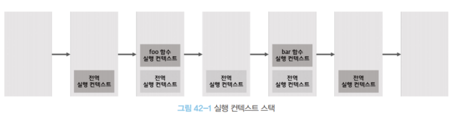
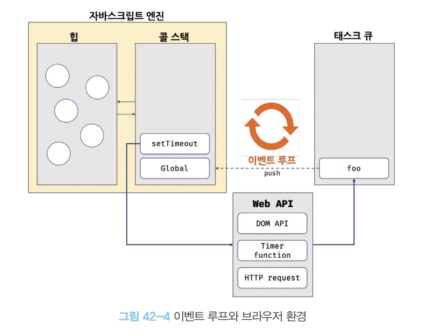

# [42장] 비동기 프로그래밍

## 42.1 동기 처리와 비동기 처리

함수를 호출할 시, 함수 코드가 평가되어 함수 실행 컨텍스트가 생성된다.

이때 생성된 함수 실행 컨텍스트는 실행 컨텍스트 스택(콜 스택)에 추가되며 코드의 실행이 이루어진다.

함수 코드 실행이 종료된 후에는 콜스택에서 제거된다.

아래 간단한 예제를 보자.

```javascript
const foo = () => {};
const bar = () => {};

foo();
bar();
```



이렇게 함수 실행 컨텍스트 스택에 추가되어야 함수 실행이 이루어지는 것이다.

자바스크립트 엔진은 이 실행 컨텍스트가 단 하나다. 따라서 함수는 한 번에 하나 씩만 실행되는데, 이 방식을 싱글 스레드(single thread) 방식이라고 한다.

이 싱글 스레드 방식에서는 한 번에 하나의 코드만 실행이 가능하기에, 수행 시간이 오래걸리는 경우 다른 작업을 블로킹(blocking, 작업 중단)한다.

아래 `setTimeout` 함수를 모방하는 함수를 구현해 블로킹을 확인해 보자.

```javascript
// sleep 함수는 일정 시간(delay)이 경과한 이후, 콜백 함수 호출
function sleep(func, delay) {
  // Date.now() 현재 시간을 숫자(ms)로 반환
  const delayUntil = Date.now() + delay;

  // 현재 시간에 delay 를 더한 delayUntil 이 현재 시간보다 작으면 계속 반복
  // 즉 delay 까지 기다린다는 의미.
  while (Date.now() < delayUntil);

  // 일정 시간(delay)이 경과한 후 콜백함수 호출.
  func();
}

function foo() {
  console.log("foo");
}

function bar() {
  console.log("bar");
}

sleep(foo, 3 * 1000);

// sleep 함수가 3초 동안 대기한 후 실행이 된다.
// bar 는 3초 대기 후, sleep 함수가 실행이 종료한 후에야 실행된다.
bar();
```

앞서 다룬 것 처럼, 작업의 순서가 있기 때문에 3초를 기다린 뒤에야 다음 코드가 실행 되었다. 이렇게 순차적으로 코드가 실행되는 것을 **동기(synchronous)** 처리라고 한다.

이번엔 위 예시를 `setTimeout` 을 사용하면 이렇게 된다.

```javascript
function foo() {
  console.log("foo");
}

function bar() {
  console.log("bar");
}

// 타이머 함수 setTimeout 은 일정 시간이 경과한 후 콜백함수 foo 를 호출한다.
setTimeout(foo, 3 * 1000);

bar();

// "타이머 설정" -> "bar" 출력 -> "foo" 출력
```

`setTimeout` 은 앞선 `sleep` 함수와 달리 타이머 설정 후 `bar()` 함수가 먼저 호출되었다.

이렇게 순서를 건너 뛰고 실행되는 방식을 **비동기(asynchronous)** 라고 한다.

동기 방식과 달리, 비동기 처리 방식은 실행 순서를 보장하지 않지만 블로킹이 일어나지는 않는다.

비동기 처리는 앞서 살펴본 `setTimeout` 과 `setInterval`, HTTP 요청, 이벤트 핸들러들의 동작 방식이다.

또한, 이벤트 루프와 태스크 큐와 깊은 관련이 있다.

## 42.2 이벤트 루프와 태스크 큐

자바스크립트가 싱글 스레드로 동작한다는 것을 살펴보았다.
그런데, 아무리 처리 속도가 빠르다고 해도 동시에 처리할 수는 없다.

우리가 사용할 때는 동시에 다양한 작업 처리가 일어나는 것 같은데, 어떻게 가능한 걸까?

HTML 요소의 애니메이션 부터, HTTP 요청을 통해 서버로 부터 데이터를 가져오기 까지 한다. 이렇게 동시성을 지원해주는 것은 브라우저에 내장된 **이벤트 루프(Event Loop)** 덕분이다.



위 그림에서 보는 것 처럼, V8 엔진 등 대부분의 엔진은 힙과 콜 스택으로 나뉘어있다.

- 콜 스택(call stack)
  우리가 지금까지 콜 스택, 콜 스택 했던 게 이 콜 스택이었다!
  함수를 호출하면 함수 실행 컨텍스트가 콜 스택에 추가되며 실행된다.

- 힙(heap)
  힙은 객체가 저장되는 메모리 공간으로, 콜 스택에 함수가 추가되면 힙에 함수 객체가 저장된다. 실행 컨텍스트는 이 공간을 참조하게 되는 것이다.
  다만, 객체는 크기가 정해져있지 않기에 힙에서 얼만큼의 공간을 사용할 것인지는 런타임 시에 결정된다.

이런 구조에서, 동기 처리방식은 쉽게 이해할 수 있을 것이다.

비동기 처리에서 소스코드의 평가, 실행을 제외한 다른 모든 것은 브라우저나 Node.js 의 담당인데 이를 살펴보자.

`setTimeout` 함수 예시를 들어보면, 이 코드가 평가 그리고 실행되는 것은 우리가 알고 있는 그대로 이루어 진다. 다만, 호출 스케줄링(정해진 시점에 함수를 호출)을 위한 타이머와 어떤 함수를 호출 할 지는 브라우저나 Node.js 의 역할이라는 것이다.

브라우저 환경에서는 이를 관리하기 위해 태스크 큐와 이벤트 루프를 제공한다.

- 태스크 큐(task queue / event queue / callback queue)
  setTimeout 이나 setInterval 과 같은 비동기 함수의 콜백 함수나 등록한 이벤트 핸들러를 임시 보관하는 장소다.

- 이벤트 루프(event loop)
  이벤트 루프는 콜 스택에 현재 실행 중인 실행 컨텍스트가 있는지, 태스크 큐에 보관되어 있는 함수가 존재하는지 계속해서 확인한다.
  이때, 콜 스택에는 비어 있지만 태스크 큐에는 대기중이라면 이벤트 루프는 선입선출 방식으로 태스크 큐 -> 콜 스택 으로 이동시킨다.

아래 예시를 통해 이벤트 루프와 태스크 큐에 대해 익혀보자.

```javascript
function foo() {
  console.log("foo");
}

function bar() {
  console.log("bar");
}

setTimeout(foo, 0);

bar();

// "타이머 설정" -> "bar" 출력 -> "foo" 출력
```

아래 코드는 다음과 같이 동작한다.

1. 전역 코드 평가 후 전역 실행 컨텍스트 생성이 되고 이 컨텍스트가 콜 스택에 추가된다.
2. 전역 코드가 실행되며 `setTimeout` 함수가 호출된다. 이때, 함수 실행 컨텍스트가 콜 스택에 추가되며 현재 실행 중인 실행 컨텍스트가 된다. 동시에 브라우저 Web API인 타이머 함수도 함수 실행 컨텍스트를 생성한다.
3. setTimeout 함수가 실행되면, 콜백 함수를 호출 스케줄링한 뒤에 콜 스택에서 제거(종료)된다. 타이머 설정이 된 이후에는 전적으로 브라우저의 역할인 것이다.
4. 아래의 4-1 은 브라우저에서 수행하고, 4-2 는 자바스크립트 엔진이 수행하며 병행 처리가 된다.
   4-1. 브라우저는 타이머를 설정한 후, 타이머가 만료되면 콜백 함수를 태스크 큐에 푸시한다.
   4-2. bar 함수가 호출되며 bar 함수 실행 컨텍스트가 생성되고 콜 스택에 푸시돼 실행 중인 실행 컨텍스트가 된다. 이후 실행이 끝나면 콜 스택에서 제거된다.
5. 전역 코드 실행이 종료되고 전역 실행 컨텍스트도 콜 스택에서 제거되어 콜 스택이 비어있는 상태가 된다.
6. 이벤트 루프가 콜 스택이 빈 것을 감지하고 태스크 큐에서 대기 중인 콜백 함수 foo 가 이벤트 루프에 의해 콜 스택에 푸시된다. 이제서야 foo 함수의 실행 -> 종료 -> 콜 스택에서 제거 까지 이루어진다.

이처럼, 비동기 함수의 콜백 함수는 태스크 큐에 먼저 푸시된 다음 콜 스택이 모두 빌 때까지 대기한 다음에 콜 스택에 추가되어 실행된다.

자바스크립트는 싱글 스레드로 동작한다고 다뤘는데, 이는 자바스크립트 엔진에 한정한 것이다. 브라우저는 멀티 스레드로 동작할 수 있다.
브라우저가 멀티 스레드를 지원하지 않고, 자바스크립트 엔진에서만 처리된다면 비동기 처리로 동작할 수는 없게 된다.
