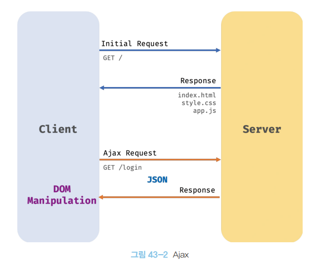

# [43장] Ajax

## 43.1 Ajax 란?

Ajax(Asynchronous Javascript and XML)란 자바스크립트를 사용해 브라우저가 서버에게 비동기 방식으로 데이터를 요청하고, 서버가 응답으로 보낸 데이터를 수신해 웹 페이지를 동적으로 갱신하는 프로그래밍 방식을 말한다.

이때, HTTP 비동기 통신을 위한 메서드와 프로퍼티를 제공하는 Web API 인 XMLHttpRequest 객체를 기반으로 동작한다.

XMLHttpRequest 객체 이전의 웹 페이지는 아래와 같이 동작했다.


클라이언트가 요청을 보내면, 서버는 응답에 웹 페이지를 구성하는 모든 요소를 전달해주는 방식이었다.
그러나, 이 방식은 비효율적이었다.

1. 이전 웹 페이지와 차이가 없어 변경할 필요가 없는 부분이 많더라도, 서버로 부터 새로 받아온 HTML 을 이용해 브라우저가 렌더링을 해야한다. 이때, 화면이 깜빡이는 현상이 있어 UX가 저하된다.
2. 클라이언트와 서버와의 통신이 동기 방식으로 동작해 응답이 있을 때 까지 다음 작업의 블로킹이 일어난다.



하지만, Ajax 의 등장으로 이 문제점을 해결할 수 있었다.

1. 변경이 필요한 부분의 데이터만 서버로 부터 전송 받아 효율적이다.
2. 이와 동시에 전체 페이지의 렌더링이 일어나지 않아 화면이 깜빡이지 않는다.
3. 클라이언트와 서버와의 통신이 비동기 방식으로 동작하기에 서버에게 요청을 보낸 이후에도 블로킹이 일어나지 않는다.

## 43.2 JSON

JSON(JavaScript Object Notation)은 클라이언트와 서버 간의 HTTP 통신을 위한 텍스트 데이터 포맷이다. JS 의 객체 리터럴 표기법을 사용할 뿐 대부분의 프로그래밍 언어에서 사용이 가능하다.

### 📝 JSON 표기 방식

```javascript
{
    "name": "Lee",
    "age": "20,
    "alive": true,
    "hobby": ["traveling", "tennis"]
}
```

이렇게 키와 값으로 구성되며, 텍스트로만 이루어져있다.

다만, 객체의 키를 표시할 때와 문자열 값을 표시할 때는 반드시 `""` 큰 따옴표를 사용해야한다.

JSON 객체는 별도의 메서드를 갖고 있다. 이에 대해 알아보자.

### 📝 JSON.stringify

JSON.stringify 메서드는 객체(배열 포함)를 JSON 포맷의 문자열로 반환하며, 클라이언트가 서버로 객체를 전송할 경우 사용해주면 된다.
이 과정을 직렬화(serializing)

일반 자바스크립트 객체를 전송할 수는 없고, 문자열 형태로 데이터를 주고받기 때문이다.

```javascript
const obj = {
  name: "Lee",
  age: 20,
  alive: tue,
  hobby: ["traveling", "tennis"],
};

const json = JSON.stringify(obj);
console.log(typeof json, json);
// string {"name": "Lee", "age": 20, "alive": true, "hobby": ["traveling", "tennis"]}

// 객체를 JSON 포맷의 문자열로 변환하면서 2칸 들여쓰기 함
const prettyJson = JSON.stringify(obj, null, 2);
console.log(typeof prettyJson, prettyJson);

/* 
string {
  "name": "Lee",
  ...
}
*/

const todos = [
  { id: 1, content: "HTML", completed: false },
  { id: 2, content: "CSS", completed: true },
  { id: 3, content: "JS", completed: false },
];

const arr = JSON.stringify(todos, null, 2);
console.log(typeof arr, arr);

/* 
string [
{
  "id": 1,
  "content": "HTML",
  "completed": false,
},
...
]
*/
```

### 📝 JSON.parse

JSON.parse 메서드는 JSON 포맷의 문자열을 객체로, 배열은 배열 형태로 변환한다.
서버가 클라이언트에게 보낸 응답은 JSON 문자열 형식이기에, 객체화해주는 과정이 필요하다. 이는 역직렬화(deserializing)라 한다.

```javascript
const obj = {
  name: "Lee",
  age: 20,
  alive: tue,
  hobby: ["traveling", "tennis"],
};

const json = JSON.stringify(obj);

const parsed = JSON.parse(json);
console.log(typeof parsed, parsed);
// object {name:"Lee", ...}

const todos = [
  { id: 1, content: "HTML", completed: false },
  { id: 2, content: "CSS", completed: true },
  { id: 3, content: "JS", completed: false },
];

const arr = JSON.stringify(todos);

const parsed = JSON.parse(json);
console.log(typeof json, json);

/*
object [
  { id: 1, content: "HTML", completed: false },
  { id: 2, content: "CSS", completed: true },
  { id: 3, content: "JS", completed: false },
];
*/
```

## 43.3 XMLHttpRequest

XMLHttpRequest 를 통해 자바스크립트로 HTTP 요청을 보내는 방법을 알아보자.

### 📝 XMLHttpRequest 객체 생성

XMLHttpReqeust 생성자 함수를 호출해 생성한다. XMLHttpRequest 객체는 브라우저에서 제공하는 Web API이므로 브라우저 환경에서만 정상적으로 실행된다.

```javascript
const xhr = new XMLHttpRequest();
```

### 📝 XMLHttpRequest 객체의 프로퍼티와 메서드

📗 XMLHttpRequest 객체의 프로토타입 프로퍼티

| 프로토타입 프로퍼티 | 설명                                                                                                 |
| ------------------- | ---------------------------------------------------------------------------------------------------- |
| readyState          | HTTP 요청의 현재 상태를 나타내는 정수. UNSET: 0, OPENED: 1, HEADERS_RECEIVED: 2, LOADING: 3, DONE: 4 |
| status              | HTTP 요청에 대한 응답 상태(HTTP 상태 코드) ex) 200, 404                                              |
| statusText          | HTTP 요청에 대한 응답 메시지 ex) OK                                                                  |
| responseType        | HTTP 응답 타입 ex) document, json, text, blob, arraybuffer                                           |
| response            | HTTP 요청에 대한 응답 몸체(response body)                                                            |
| responseText        | 서버가 전송한 HTTP 요청에 대한 응답 문자열                                                           |

📗 XMLHttpRequest 객체의 이벤트 핸들러 프로퍼티

| 이벤트 핸들러 프로퍼티 | 설명 |
|onreadystatechange | readyState 프로퍼티의 값이 변경된 경우 |
| onloadstart | HTTP 요청에 대한 응답을 받기 시작한 경우 |
| onprogress | HTTP 요청에 대한 응답을 받는 도중 주기적으로 발생 |
| onabort | abort 메서드에 의해 HTTP 요청이 중단된 경우 |
| onerror | HTTP 요청에 에러가 발생한 경우 |
| onload | HTTP 요청 시간이 초과한 경우 |
| ontimeout | HTTP 요청 시간이 초과한 경우 |
| onloadend | HTTP 요청 성공 / 실패 시 발생 |

📗 XMLHttpRequest 객체의 메서드

| 메서드 | 설명 |
| open | HTTP 요청 초기화 |
| send | HTTP 요청 전송 |
| abort | 이미 전송한 HTTP 요청 중단 |
|setRequestHeader | 특정 HTTP 요청 헤더의 값 설정 |
| getResponseHeader |특정 HTTP 요청 헤더의 값을 문자열로 반환 |

📗 XMLHttpRequest 객체의 정적 프로퍼티

| 정적 프로퍼티 | 값 | 설명 |
| UNSENT | 0 | open 메서드 호출 이전 |
| OPENED | 1 | open 메서드 호출 이후 |
| HEADERS_RECEIVED | 2 | send 메서드 호출 이후 |
| LOADING | 3 | 서버 응답 중(응답 데이터 미완성 상태) |
|DONE | 4 | 서버 응답 완료 |

### 📝 HTTP 요청 전송

HTTP 요청을 전송하는 경우 다음 순서를 따른다.

1. XMLHttpRequest.prototype.open 메서드로 HTTP 요청 초기화
2. 필요에 따라 setRequestHeader 메서드로 특정 HTTP 요청 헤더 값 설정
3. send 메서드로 HTTP 요청 전송

```javascript
// XMLHttpRequest 객체 생성
const xhr = new XMLHttpRequest();

// HTTP 요청 초기화
xhr.open("GET", "/users");

// HTTP 요청 헤더설정
// 클라이언트에서 응답으로 json 형식의 데이터 타입 지정
xhr.setRequestHeader("content-type", "application/json");

// HTTP 요청 전송
xhr.send();
```

📗 XMLHttpRequest.prototype.open

open 메서드는 서버에 전송할 HTTP 요청을 초기화한다. open 메서드를 호출하는 방법은 다음과 같다.

```javascript
xhr.open(method, url[, async])
```

| 매개변수 | 설명 |
| method | HTTP 요청 메서드("GET", "POST", "PUT", "DELETE" 등) |
|url | HTTP 요청을 전송할 URL |
| async | 비동기 요청 여부, 옵션으로 기본값은 true 이며, 비동기로 동작 |

📗 XMLHttpRequest.prototype.send

send 메서드는 open 메서드로 초기화한 HTTP 요청을 서버에 전송한다.

이때, GET 방식과 POST 방식에 따라 차이가 있다.

- GET 요청 메서드의 경우, 데이터를 URL 의 일부분인 쿼리 문자열(query string)로 전송
- POST 요청 메서드의 경우, 데이터(payload)를 요청 몸체(request body)에 담아 전송

```javascript
xhr.send(JSON.stringify({ id: 1, content: "HTML", completed: false }));
```

POST 요청 시, 이렇게 전송할 데이터를 `stringfy` 로 직렬화 한 뒤 보내주면 된다.

GET 요청 시, body 에 payload 를 전달하더라도 무시되고 body 가 null 로 설정된다.

📗 XMLHttpRequest.prototype.setRequestHeader

setRequestHeader 메서드는 특정 HTTP 요청의 헤더 값을 설정한다.

이때, 자주 사용하는 요청 헤더인 Content-type 과 Accept 에 대해서 간단히 알아보자.

| MIME 타입 | 서브타입 |
| text | text/plain, text/html, text/css, /text/javascript |
| application | application/json, application/x-www-form-urlencode |
| multipart | multipart/formed-data |

```javascript
const xhr = new XMLHttpRequest();

xhr.open("POST", "/users");

xhr.setRequestHeader("content-type", "application/json");

xhr.send(JSON.stringify({ id: 1, content: "HTML", completed: false }));
```

위 예시는 서버에게 데이터를 보낼 때, json 형식이라고 지정하는 예시다.

다음은 서버에게 받아오는 데이터의 형식을 지정하는 방법을 살펴보자.

```javascript
xhr.setRequestHeader("accept", "application/json");
```

### 📝 HTTP 응답 처리

서버가 전송한 응답을 처리하려면 XMLHttpRequest 객체가 발생시키는 이벤트를 감지해야한다.

이때, 감지해야하는 이벤트는 readystatechange 다. readystate 프로퍼티는 HTTP 요청의 현재 상태를 나타내기 때문이다.

이를 코드로 살펴보자.

```javascript
const xhr = new XMLHttpRequest();

xhr.open("GET", "https://jsonplaceholder.typicode.com/todos/1");

xhr.send();

// HTTP 요청의 현재 상태를 나타내는 readystate 프로퍼티 변경시 발생
xhr.onreadystatechange = () => {
  if (xhr.readystate !== XMLHttpRequest.DONE) return;

  if (xhr.status === 200) {
    console.log(JSON.parse(xhr.response));
    // {userId: 1, id: 1, title: "title", completed: false}
  } else {
    console.error("Error", xhr.status, xhr.statusText);
  }
};
```

send 메서드를 통해 HTTP 요청을 서버에 전송하면 서버는 응답을 반환한다.
하지만, 클라이언트가 언제 응답을 받았는지 알 수 없다.

이때 이용하는 게 readystatechange 이벤트의 변화다.

위 예시는 readystate 프로퍼티가 변하는 것을 기다리다가 요청이 성공적으로 이루어지면 해당 내용을 출력하고, 오류가 발생하면 이를 반환한다.

요청이 성공적으로 이루어졌을 때만 처리를 원하는 경우, load 이벤트를 이용하면 된다.
이 이벤트는 요청이 성공적으로 완료된 경우에만 발생한다.
