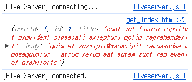
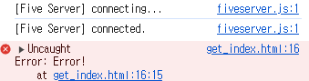
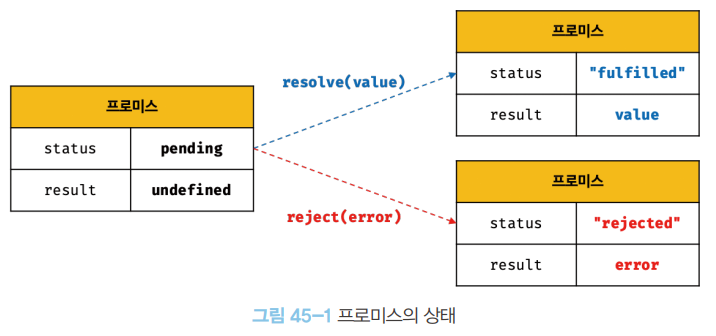
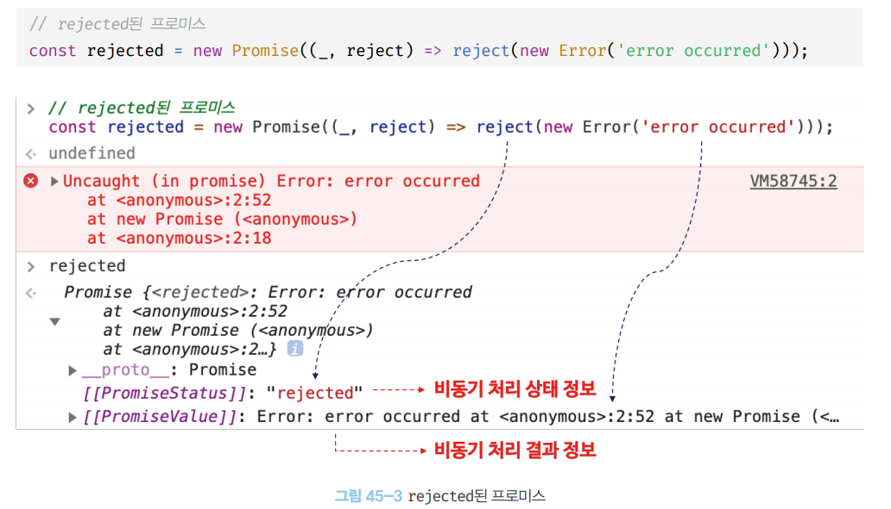

# [45장] 프로미스

> 자바스크립트에서 비동기 처리를 위해서 콜백 함수를 자주 사용한다. 그러나 이런 패턴은, 콜백 지옥을 만들어 내기에 가독성, 유지보수성이 저하되는 문제가 있었다. 이를 위해 프로미스를 도입해 비동기 처리 시점을 명확히 표현할 수 있게 됐다!

## 45.1 비동기 처리를 위한 콜백 패턴의 단점

### 📝 콜백 지옥


```javascript
// GET 요청을 위한 비동기 함수
const get = (url) => {
  const xhr = new XMLHttpRequest();

  xhr.open("GET", url);
  xhr.send();

  //  onload 이벤트 핸들러는 get1 함수 종료 이후, 비동기로 동작함
  xhr.onload = () => {
    if (xhr.status === 200) {
      // 서버의 응답을 콘솔에 출력
      console.log(JSON.parse(xhr.response));
    } else {
      console.error(`${xhr.status} ${xhr.statusText}`);
    }
  };
};

get("https://jsonplaceholder.typicode.com/posts/1");

/*
{
    "userId" : 1,
    "id": 1,
    "title": "...",
    ...
}
*/
```

위 예제에서, `get` 함수는 서버의 응답을 올바르게 콘솔에 출력해준다.



`get` 함수는 비동기 함수인데 `get` 의 경우 함수가 종료된 후 이벤트 핸들러가 별도로 동작하게 된다.

`get` 함수의 동작을 이벤트 루프와 연관지어 분석해보자.

1. 함수 호출: `get()` 함수 호출, 실행 컨텍스트 생성됨
2. XMLHttpRequset 객체 생성
3. 요청 준비: `xhr.open()` 를 통해 GET 요청 준비
4. 요청 전송: `xhr.send()` 를 통해 요청 전송

5. onload 이벤트 핸들러 등록 => 내부에 정의한 콜백함수는 비동기로 동작하게 됨.

6. 응답 도착: 서버로 부터 응답이 도착하면 브라우저는 onload 이벤트 핸들러를 태스크 큐에 추가
7. 이벤트 루프: 이벤트 루프는 콜 스택이 비어있는지 확인하며, 비게되면 태스크 큐에 존재하는 작업을 콜 스택으로 옮김.
8. onload 이벤트 핸들러 실행: 콜 스택에서 이벤트 핸들러의 내부 코드를 마침내 실행

onload 이벤트 핸들러는, 이미 `get1` 함수가 종료된 후에 동작하기에 비동기 처리로 받아오는 결과를 `console.log()` 로 내부에서 출력하는 것은 동작하지만 외부로 반환하거나 할당하려고 하면 동작하지 않는 것이다.

이번엔 이벤트 핸들러에서 응답을 상위 스코프로 반환하도록 만들어보자.
하지만 이 역시 동작하지 않는다.

```javascript
const get = (url) => {
  const xhr = new XMLHttpRequest();

  let result;
  xhr.open("GET", url);
  xhr.send();

  //  onload 이벤트 핸들러는 get1 함수 종료 이후, 비동기로 동작함
  xhr.onload = () => {
    if (xhr.status === 200) {
      // 서버의 응답을 반환
      result = xhr.response;
      return JSON.parse(xhr.response);
    } else {
      console.error(`${xhr.status} ${xhr.statusText}`);
    }
  };

  console.log(result); // undefined
};

const response = get("https://jsonplaceholder.typicode.com/posts/1");
console.log(response); // undefined
```

앞서 이야기한 것 처럼, `get` 함수의 결과를 `get` 함수의 상위 스코프 변수에 할당하려고 해도 의도처럼 동작하지 않는다.

이벤트 핸들러에서 상위 스코프로 값을 할당하려고 해도 불가능한 이유는, 이벤트 핸들러가 호출된 상황에서 상위 스코프의 코드는 이미 실행이 모두 끝난 뒤기 때문이다.

그래서, 콜백 함수 형태인 비동기 함수 내에서 처리를 직접 해야만 하는 것이다. (이벤트 핸들러 내부에서 `console.log(xhr.response)` 하듯이)

하지만 다양한 처리를 위해서 콜백함수를 추가하다 보니, 처음에 본 것 처럼 복잡한 콜백 지옥이 만들어지는 것!

이 콜백 지옥은 가독성을 떨어트릴 뿐 아니라, 유지보수도 어렵게 만든다.

```javascript
try {
  setTimeout(() => {
    throw new Error("Error!");
  }, 1000);
} catch (err) {
  console.error("에러 발생", err);
}
```

이렇게 작성하면, 오류가 발생하더라도 catch 문이 동작하지 않는다.



그냥 setTimeout 의 콜백함수가 동작할 뿐이다.

그 이유는, catch 문이 동작하기 위해서는 setTimeout 의 콜백함수가 상위 스코프의 실행 컨텍스트들이 존재할 때 동작해야한다.

앞서 다뤘던 것 처럼, 이미 다른 코드의 실행이 모두 끝나고 `() => {
    throw new Error("Error!");
  }` 이 코드 하나만 남아있는 상황인 것이다.

이를 해결하기 위해, Promise 를 도입해 보다 간결하게 표현하도록 만들었다.

## 45.2 프로미스의 생성

Promise 는 `new` 연산자 + `Promise 생성자 함수` 형태로 생성하면 된다.

Promise 생성자 함수는 비동기 처리를 수행할 콜백함수를 인수로 받는다.

예시를 보면서 알아보자.

```javascript
const promise = new Promise((resolve, reject) => {
  // Promise 함수의 콜백 함수 정의
  if (suceess) {
    resolve("result");
  } else {
    reject("failure reason");
  }
});
```

위 함수는 비동기 처리가 성공하면 resolve 함수를 호출하고, 실패하면 reject 함수를 호출한다.

이를 통해 예시로 들었던 `get` 함수를 다시 구현하면 다음과 같음.

```javascript
const promsisGet = (url) => {
  return new Promise((resolve, reject) => {
    const xhr = new XMLHttpRequest();
    xhr.open("GET");
    xhr.send();

    xhr.onload = () => {
      if (xhr.status === 200) {
        resolve(JSON.parse(xhr.response));
      } else {
        reject(new Error(xhr.status));
      }
    };
  });
};

promiseGet("https://jsonplaceholder.typicode.com/posts/1");
```

새롭게 작성한 함수 `promiseGet`은 함수 내부에서 프로미스를 생성하고 반환한다. 비동기 처리가 성공하면 그 결과를 `resolve()` 함수에 인수로 전달한다. 만약, 실패한다면 그 결과를 `reject()` 함수에 인수로 전달해 호출한다.

프로미스는 3가지의 비동기 처리 상태 정보를 표현한다.

| 상태 | 의미 | 상태 변경 조건 |
| pending | 비동기 처리가 아직 수행되지 않은 상태 | 프로미스가 생성된 직후 기본 상태 |
| fulfilled | 비동기 처리가 수행된 상태(성공) | resolve 함수 호출 |
| rejected | 비동기 처리가 수행된 상태(실패) | reject 함수 호출 |






## 45.3 프로미스의 후속 처리 메서드

프로미스가 어떤 방식으로 구성되어있는지 알았으니, 활용하는 예시를 보자.

비동기 처리가 성공해 프로미스가 fulfilled 상태가 되면 이 결과를 가지고 다음 작업을 진행할 것이고, rejected 상태가 되면 에러 처리를 하게 될 것이다. 이를 위해 사용할 수 있는 메서드들을 알아보자!

### 📝 Promise.prototype.then

`then` 메서드는 두 개의 콜백함수를 인수로 전달받는다.

첫 번째 콜백 함수는 fulfilled 상태일 때 그 결과를 가지고 동작하며, 두 번째 콜백 함수는 rejected 상태일 때 에러 처리를 한다.

```javascript
new Promise((resolve) => resolve("fulfilled")).then(
  (value) => console.log("fulfilled : ", value),
  (err) => console.error("error : ", err)
); // fulfilled

new Promise((_, reject) => reject(new Error("rejected"))).then(
  (value) => console.log("fulfilled : ", value),
  (err) => console.error("error : ", err)
); // rejected
```

then 은 언제나 프로미스를 반환한다.

### 📝 Promise.prototype.catch

catch 메서드는 한 개의 콜백 함수를 인수로 전달 받는다.
이 콜백함수는 rejected 상태일 때만 호출된다.

```javascript
new Promise((_, reject) => reject(new Error("rejected"))).catch(
    (error) => console.log(error); // Error: rejected
)
```

catch 역시 마찬가지로, 언제나 프로미스를 반환한다.

```javascript
new Promise((_, reject) => reject(new Error("rejected"))).then(
    (undefined, err) => console.log(err); // Error: rejected
)
```

### 📝 Promise.prototype.finally

finally 메서드는 한 개의 콜백 함수를 인수로 전달받는다.
finally 메서드의 콜백 함수는 비동기 처리의 성공 / 실패 여부에 관계 없이 무조건 한 번 호출된다.

```javascript
new Promise(() => {}).finally(
  () => console.log("finally") // finally
);
```

```javascript
const promiseGet = (url) => {
  return new Promise((resolve, reject) => {
    const xhr = new XMLHttpRequest();

    xhr.open("GET", url);
    xhr.send();

    xhr.onload = () => {
      if (xhr.status === 200) {
        // 처리 성공 시 resolve 호출
        resolve(JSON.parse);
      } else {
        // 예외 처리를 위해 추가
        reject(new Error(xhr.status));
      }
    };
  });
};

promiseGet("https://jsonplaceholder.typicode.com/posts/1")
  //  성공 시 결과 출력
  .then((res) => console.log(res))
  //  오류 발생 시 출력
  .catch((err) => console.error(err))
  //  무조건 호출
  .finally(() => console.log("Bye!"));
```

## 45.4 프로미스의 에러 처리

앞서 다룬 것 처럼, `then()` 또한 에러 처리를 담당하는 콜백 함수를 전달할 수 있다.

```javascript
const wrongUrl = "https://jsonplaceholder.typicode.com/wrongUrl/1";

promiseGet(wrongUrl)
  .then((res) => console.log(res))
  .then((undefined, err) => console.error(err));
```

다만, 이렇게 하면 첫 번째 콜백에서 오류가 발생하지 않으면 처리가 어렵다.

따라서 아래와 같이 처리할 수 있다.

```javascript
promiseGet("https://jsonplaceholder.typicode.com/wrongUrl/1").then(
  (res) => console.log(res),
  (err) => console.error(err)
);
```

하지만 이렇게 작성하면 가독성이 떨어지니, catch 를 사용하자.

```javascript
promiseGet("https://jsonplaceholder.typicode.com/wrongUrl/1")
  .then((res) => console.log(err))
  .catch((err) => console.error(err));
```

## 45.5 프로미스 체이닝

앞서 프로미스 후속 처리 메서드들은 언제나 프로미스를 반환한다고 했다.
따라서, 후속 메서드를 사용한 뒤 체이닝이 가능하다.

```javascript
const url = "https://jsonplaceholder.typicode.com";

// promiseGet => id 가 1 인 post 얻어옴
promiseGet(`${url}/posts/1`)
// 이를 통해 글 작성자의  userId 얻어옴
.then({ userId } => promiseGet(`${url}/users/${userId}`))
// 이를 통해 얻어온 유저 정보 출력
.then((userInfo) => console.log(userInfo))
// 오류 발생시 오류 출력
.catch((err) => console.error(err))
```

위 메서드들은 자체로 반환 값이 프로미스가 아니더라도 모두 값을 프로미스로 변환해서라도 반환한다.

프로미스를 통해 콜백 지옥은 해결했으나, 체이닝에서도 콜백함수를 이용하기 때문에 완전 해결한 것은 아니다.

결국 체이닝이 깊어지면 콜백 함수의 사용이 늘어나고, 또 다른 형태의 콜백 지옥이 만들어진다. 이를 해결하기 위해 비동기 처리를 동기 처리 형태로 동작하게 만들어주는 async / await 를 사용하면 된다.

```javascript
const url = "https://jsonplaceholder.typicode.com";

// 즉시 실행 함수
(async () => {
    // promiseGet => id 가 1 인 post 얻어옴
    const { userId } => await promiseGet(`${url}/posts/1$`)
    // 이를 통해 글 작성자의  userId 얻어옴
    const userInfo => await promiseGet(`${url}/users/${userId}`);
    // 이를 통해 얻어온 유저 정보 출력
    console.log(userInfo);
})();
```

async / await 은 다음에 다시 다룰 것

## 45.6 프로미스의 정적 메서드
